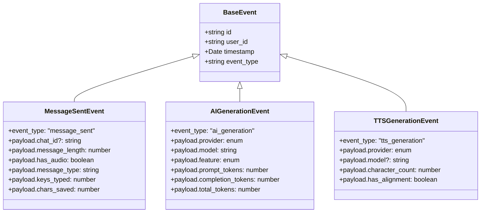
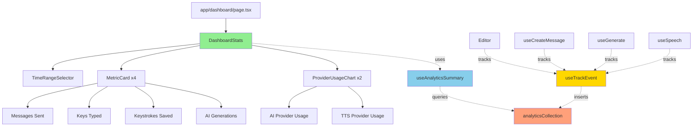
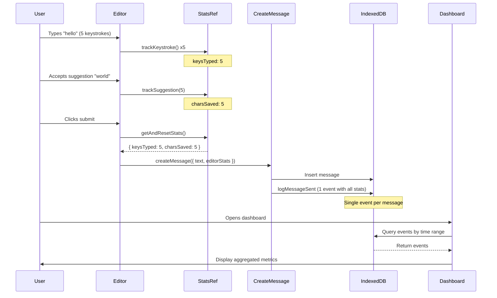

# Dashboard Analytics Implementation Plan

> **For Claude:** Use executing-plans to implement this plan task-by-task.

**Date**: 2025-12-30
**Feature**: User engagement analytics and dashboard metrics
**Approach**: Event sourcing with local-only IndexedDB storage
**Tech Stack**: TanStack DB (IndexedDB), Zod schemas, React hooks, Vercel AI SDK usage extraction

**User Decisions (Confirmed)**:

- **Storage**: Local-only IndexedDB (no cloud sync for privacy)
- **Tracking Pattern**: Immutable fact events (event sourcing)
- **Keystroke Savings**: Simple calculation (`saved = suggestion.length - chars_typed`)
- **Data Retention**: 90 days
- **Token Tracking**: Extract actual usage data from Vercel AI SDK responses
- **Dashboard Views**: Day/Week/Month time range selector

---

## 1. Overview

### Goal

Track user engagement metrics (messages, keystrokes, AI/TTS usage) using immutable event logging. Display aggregated statistics on the dashboard with day/week/month views.

### Architecture Principles

- **Event Sourcing**: Log immutable fact events, compute aggregates on read
- **Local-First**: IndexedDB only (no cloud sync)
- **Non-Blocking**: Event logging is fire-and-forget, never blocks UI
- **Type-Safe**: Discriminated union event types with Zod schemas

### Success Criteria

- [ ] Linter passes (`pnpm run lint`)
- [ ] Events logged without UI lag (<10ms overhead)
- [ ] Dashboard loads metrics in <500ms with 10K events
- [ ] 90-day retention cleanup runs automatically
- [ ] All 3 event types tracked correctly (message_sent, ai_generation, tts_generation)
- [ ] Time range selector updates metrics

---

## 2. Event Schema Design

### Base Event Structure

All events share a common structure with type-specific payloads using a discriminated union pattern:

```typescript
// packages/analytics/types/index.ts
import { z } from 'zod';

// Base event schema
const BaseEventSchema = z.object({
  id: z.uuid(),
  user_id: z.string(),
  timestamp: z.coerce.date(),
});

// Event type discriminators
// NOTE: Keystroke data is embedded in message_sent events (1 event per message)
// Editor tracks keystrokes via onKeyDown and returns stats on submit
const MessageSentEventSchema = BaseEventSchema.extend({
  event_type: z.literal('message_sent'),
  payload: z.object({
    chat_id: z.string().optional(),
    message_length: z.number(),
    has_audio: z.boolean(),
    message_type: z.string(), // 'message' | 'question' | 'statement'
    // Keystroke tracking (from editor)
    keys_typed: z.number(), // Total key presses (from onKeyDown count)
    chars_saved: z.number(), // Characters saved from suggestions
  }),
});

const AIGenerationEventSchema = BaseEventSchema.extend({
  event_type: z.literal('ai_generation'),
  payload: z.object({
    provider: z.enum(['gemini', 'webllm']),
    model: z.string(),
    feature: z.enum(['suggestions', 'transcription', 'keyboard_generation']),
    prompt_tokens: z.number(), // From Vercel AI SDK response.usage.promptTokens
    completion_tokens: z.number(), // From Vercel AI SDK response.usage.completionTokens
    total_tokens: z.number(), // From Vercel AI SDK response.usage.totalTokens
    duration_ms: z.number().optional(),
  }),
});

const TTSGenerationEventSchema = BaseEventSchema.extend({
  event_type: z.literal('tts_generation'),
  payload: z.object({
    provider: z.enum(['elevenlabs', 'gemini', 'browser']),
    model: z.string().optional(),
    character_count: z.number(),
    has_alignment: z.boolean(),
    duration_ms: z.number().optional(),
  }),
});

// Discriminated union of all event types
// NOTE: Only 3 event types - keystroke/suggestion data merged into message_sent
export const AnalyticsEventSchema = z.discriminatedUnion('event_type', [
  MessageSentEventSchema,
  AIGenerationEventSchema,
  TTSGenerationEventSchema,
]);

export type AnalyticsEvent = z.infer<typeof AnalyticsEventSchema>;
export type MessageSentEvent = z.infer<typeof MessageSentEventSchema>;
export type AIGenerationEvent = z.infer<typeof AIGenerationEventSchema>;
export type TTSGenerationEvent = z.infer<typeof TTSGenerationEventSchema>;

// Type for creating events (id and timestamp optional)
export type CreateAnalyticsEventData = Omit<
  z.input<typeof AnalyticsEventSchema>,
  'id' | 'timestamp'
> & {
  id?: string;
  timestamp?: Date;
};
```

### Event Schema Relationships



**Simplified Design:** Only 3 event types. Keystroke and suggestion tracking is embedded in `message_sent` events. The Editor tracks keystrokes via `onKeyDown` and returns stats when submitting. This means **1 analytics event per message**.

---

## 3. Package Structure

### Directory Layout

```
packages/analytics/
├── components/
│   ├── analytics-provider.tsx          # Context provider for analytics (optional)
│   ├── dashboard-stats.tsx             # Main dashboard stats display
│   ├── time-range-selector.tsx         # Day/Week/Month selector
│   ├── metric-card.tsx                 # Reusable stat card component
│   └── provider-usage-chart.tsx        # AI/TTS usage breakdown
├── hooks/
│   ├── use-track-event.ts              # Hook to log events
│   ├── use-analytics-summary.ts        # Hook to query aggregated stats
│   └── use-retention.ts                # Hook for data retention cleanup
├── lib/
│   ├── aggregators.ts                  # Functions to compute metrics from events
│   ├── queries.ts                      # IndexedDB query helpers
│   └── retention.ts                    # Data retention policy logic
├── db.ts                               # IndexedDB collection definition
├── types/
│   └── index.ts                        # Zod schemas and TypeScript types
├── index.ts                            # Public API exports
└── README.md                           # Architecture decisions and usage guide
```

### Public API Exports

```typescript
// packages/analytics/index.ts

// Hooks
export { useTrackEvent } from './hooks/use-track-event';
export { useAnalyticsSummary } from './hooks/use-analytics-summary';

// Components
export { DashboardStats } from './components/dashboard-stats';
export { TimeRangeSelector } from './components/time-range-selector';
export { MetricCard } from './components/metric-card';
export { ProviderUsageChart } from './components/provider-usage-chart';

// Types
export type {
  AnalyticsEvent,
  MessageSentEvent,
  KeystrokeEvent,
  SuggestionAcceptedEvent,
  AIGenerationEvent,
  TTSGenerationEvent,
  CreateAnalyticsEventData,
} from './types';

// Collection (for advanced usage)
export { analyticsCollection } from './db';
```

---

## 4. Core Implementation

### 4.1 IndexedDB Collection

```typescript
// packages/analytics/db.ts
import { createCollection } from '@tanstack/react-db';

import { indexedDBCollectionOptionsV2 } from '@/lib/indexeddb/collection-v2';

import { AnalyticsEventSchema } from './types';

export const analyticsCollection = createCollection(
  indexedDBCollectionOptionsV2({
    schema: AnalyticsEventSchema,
    id: 'analytics-events',
    kvStoreOptions: {
      dbName: 'app-analytics',
    },
    channelName: 'app-analytics',
    getKey: item => item.id,
  })
);
```

### 4.2 Event Tracking Hook

```typescript
// packages/analytics/hooks/use-track-event.ts
import { useCallback } from 'react';

import { v4 as uuidv4 } from 'uuid';

import { useAccountContext } from '@/packages/account';

import { analyticsCollection } from '../db';
import { AnalyticsEvent, CreateAnalyticsEventData } from '../types';

export interface UseTrackEventReturn {
  trackEvent: (event: CreateAnalyticsEventData) => Promise<void>;
}

export function useTrackEvent(): UseTrackEventReturn {
  const { user } = useAccountContext();

  const trackEvent = useCallback(
    async (eventData: CreateAnalyticsEventData) => {
      if (!user?.id) {
        // Silently skip if no user (don't block UI)
        return;
      }

      try {
        const event: AnalyticsEvent = {
          ...eventData,
          id: eventData.id || uuidv4(),
          user_id: user.id,
          timestamp: eventData.timestamp || new Date(),
        } as AnalyticsEvent;

        // Non-blocking insert (don't await)
        analyticsCollection.insert(event).catch(err => {
          console.error('[Analytics] Failed to track event:', err);
        });
      } catch (err) {
        console.error('[Analytics] Event tracking error:', err);
        // Fail silently - analytics should never break user experience
      }
    },
    [user?.id]
  );

  return { trackEvent };
}
```

### 4.3 Analytics Summary Hook

```typescript
// packages/analytics/hooks/use-analytics-summary.ts
import { useMemo } from 'react';

import { useCollection } from '@tanstack/react-db';

import { useAccountContext } from '@/packages/account';

import { analyticsCollection } from '../db';
import { AnalyticsSummary, TimeRange, computeSummary } from '../lib/aggregators';
import { AnalyticsEvent } from '../types';

export interface UseAnalyticsSummaryParams {
  range: TimeRange; // 'day' | 'week' | 'month'
}

export interface UseAnalyticsSummaryReturn {
  summary: AnalyticsSummary | undefined;
  isLoading: boolean;
  error?: { message: string };
}

export function useAnalyticsSummary(params: UseAnalyticsSummaryParams): UseAnalyticsSummaryReturn {
  const { range } = params;
  const { user } = useAccountContext();

  // Subscribe to analytics collection
  const { data: events, isLoading } = useCollection(analyticsCollection);

  // Compute aggregates
  const summary = useMemo(() => {
    if (!events || !user?.id) return undefined;

    // Filter events by user and time range
    const userEvents = events.filter((event: AnalyticsEvent) => event.user_id === user.id);

    return computeSummary(userEvents, range);
  }, [events, user?.id, range]);

  return {
    summary,
    isLoading,
    error: undefined, // Collection errors handled by TanStack DB
  };
}
```

### 4.4 Aggregation Logic

```typescript
// packages/analytics/lib/aggregators.ts
import { AnalyticsEvent } from '../types';

export type TimeRange = 'day' | 'week' | 'month';

export interface AnalyticsSummary {
  timeRange: TimeRange;
  startDate: Date;
  endDate: Date;

  // Message metrics
  messagesSent: number;
  messagesByType: Record<string, number>;

  // Keystroke metrics
  keysTyped: number;
  keystrokesSaved: number;
  savingsPercentage: number;

  // AI usage
  aiGenerations: {
    total: number;
    byProvider: Record<string, number>;
    byFeature: Record<string, number>;
    totalTokens: number;
  };

  // TTS usage
  ttsGenerations: {
    total: number;
    byProvider: Record<string, { count: number; characters: number }>;
    totalCharacters: number;
  };
}

function getTimeRangeBounds(range: TimeRange): { start: Date; end: Date } {
  const now = new Date();
  const end = now;
  const start = new Date(now);

  switch (range) {
    case 'day':
      start.setHours(0, 0, 0, 0);
      break;
    case 'week':
      start.setDate(now.getDate() - 7);
      start.setHours(0, 0, 0, 0);
      break;
    case 'month':
      start.setDate(now.getDate() - 30);
      start.setHours(0, 0, 0, 0);
      break;
  }

  return { start, end };
}

export function computeSummary(events: AnalyticsEvent[], range: TimeRange): AnalyticsSummary {
  const { start, end } = getTimeRangeBounds(range);

  // Filter events by time range
  const rangeEvents = events.filter(event => event.timestamp >= start && event.timestamp <= end);

  // Message metrics
  const messageEvents = rangeEvents.filter(e => e.event_type === 'message_sent');
  const messagesSent = messageEvents.length;
  const messagesByType = messageEvents.reduce(
    (acc, e) => {
      if (e.event_type === 'message_sent') {
        const type = e.payload.message_type;
        acc[type] = (acc[type] || 0) + 1;
      }
      return acc;
    },
    {} as Record<string, number>
  );

  // Keystroke metrics
  const keystrokeEvents = rangeEvents.filter(e => e.event_type === 'keystroke');
  const keysTyped = keystrokeEvents.reduce((sum, e) => {
    if (e.event_type === 'keystroke') {
      return sum + e.payload.character_count;
    }
    return sum;
  }, 0);

  const suggestionEvents = rangeEvents.filter(e => e.event_type === 'suggestion_accepted');
  const keystrokesSaved = suggestionEvents.reduce((sum, e) => {
    if (e.event_type === 'suggestion_accepted') {
      return sum + e.payload.characters_saved;
    }
    return sum;
  }, 0);

  const totalTypingActivity = keysTyped + keystrokesSaved;
  const savingsPercentage =
    totalTypingActivity > 0 ? (keystrokesSaved / totalTypingActivity) * 100 : 0;

  // AI generation metrics
  const aiEvents = rangeEvents.filter(e => e.event_type === 'ai_generation');
  const aiByProvider = aiEvents.reduce(
    (acc, e) => {
      if (e.event_type === 'ai_generation') {
        acc[e.payload.provider] = (acc[e.payload.provider] || 0) + 1;
      }
      return acc;
    },
    {} as Record<string, number>
  );

  const aiByFeature = aiEvents.reduce(
    (acc, e) => {
      if (e.event_type === 'ai_generation') {
        acc[e.payload.feature] = (acc[e.payload.feature] || 0) + 1;
      }
      return acc;
    },
    {} as Record<string, number>
  );

  const totalTokens = aiEvents.reduce((sum, e) => {
    if (e.event_type === 'ai_generation') {
      return sum + (e.payload.prompt_tokens || 0) + (e.payload.completion_tokens || 0);
    }
    return sum;
  }, 0);

  // TTS generation metrics
  const ttsEvents = rangeEvents.filter(e => e.event_type === 'tts_generation');
  const ttsByProvider = ttsEvents.reduce(
    (acc, e) => {
      if (e.event_type === 'tts_generation') {
        const provider = e.payload.provider;
        if (!acc[provider]) {
          acc[provider] = { count: 0, characters: 0 };
        }
        acc[provider].count += 1;
        acc[provider].characters += e.payload.character_count;
      }
      return acc;
    },
    {} as Record<string, { count: number; characters: number }>
  );

  const totalCharacters = Object.values(ttsByProvider).reduce(
    (sum, data) => sum + data.characters,
    0
  );

  return {
    timeRange: range,
    startDate: start,
    endDate: end,
    messagesSent,
    messagesByType,
    keysTyped,
    keystrokesSaved,
    savingsPercentage,
    aiGenerations: {
      total: aiEvents.length,
      byProvider: aiByProvider,
      byFeature: aiByFeature,
      totalTokens,
    },
    ttsGenerations: {
      total: ttsEvents.length,
      byProvider: ttsByProvider,
      totalCharacters,
    },
  };
}
```

---

## 5. Integration Points

### 5.1 Editor - Keystroke & Suggestion Tracking

**Simplified Approach:** Track keystrokes via `onKeyDown` in the editor, accumulate stats internally, and return them when the user submits. This results in **1 event per message** instead of many keystroke events.

**File**: `packages/editor/hooks/use-editor.ts`

Add internal tracking state and expose stats via return value:

```typescript
// packages/editor/hooks/use-editor.ts

export interface EditorStats {
  keysTyped: number; // Total key presses (from onKeyDown)
  charsSaved: number; // Characters saved from suggestions
}

export function useEditorLogic(defaultText = '') {
  const [text, setText] = useState(defaultText);

  // Internal tracking (reset on submit)
  const statsRef = useRef<EditorStats>({ keysTyped: 0, charsSaved: 0 });

  // Track keystrokes (called from onKeyDown in Editor component)
  const trackKeystroke = useCallback(() => {
    statsRef.current.keysTyped += 1;
  }, []);

  // Track suggestion acceptance (called when suggestion is clicked)
  const trackSuggestion = useCallback((charsSaved: number) => {
    statsRef.current.charsSaved += charsSaved;
  }, []);

  // Get stats and reset (called on submit)
  const getAndResetStats = useCallback((): EditorStats => {
    const stats = { ...statsRef.current };
    statsRef.current = { keysTyped: 0, charsSaved: 0 };
    return stats;
  }, []);

  // Existing functions...
  const addWord = useCallback(
    (value: string) => {
      setText(prev => {
        const prevLength = prev.length;
        let newText = '';
        if (prev.slice(-1) === ' ' || prev.length === 0) {
          newText = prev + value + ' ';
        } else {
          newText = prev + ' ' + value + ' ';
        }
        // Track chars saved (value length minus any partial typing)
        trackSuggestion(value.length);
        return newText;
      });
    },
    [trackSuggestion]
  );

  const setCurrentWord = useCallback(
    (value: string) => {
      setText(prev => {
        if (prev.length === 0) {
          trackSuggestion(value.length);
          return value;
        }
        const tokens = tokenize(prev);
        const lastWord = tokens[tokens.length - 1] || '';
        const charsSaved = value.length - lastWord.length;
        trackSuggestion(Math.max(0, charsSaved));
        return prev.slice(0, -lastWord.length) + value + ' ';
      });
    },
    [trackSuggestion]
  );

  return {
    text,
    setText,
    addWord,
    setCurrentWord,
    // ... other existing returns
    // NEW: Tracking functions
    trackKeystroke,
    getAndResetStats,
  };
}
```

**File**: `packages/editor/components/editor.tsx`

Add `onKeyDown` handler:

```typescript
// In Editor component
const { text, setText, trackKeystroke, getAndResetStats, ...rest } = useEditorLogic();

// Add onKeyDown to track keystrokes
<textarea
  value={text}
  onChange={e => setText(e.target.value)}
  onKeyDown={(e) => {
    // Track all key presses (including backspace, etc.)
    if (e.key.length === 1 || e.key === 'Backspace' || e.key === 'Enter') {
      trackKeystroke();
    }
  }}
  // ... other props
/>
```

### 5.2 Message Sent - With Editor Stats

**File**: `packages/chats/hooks/use-create-message.ts`

The `useCreateMessage` hook receives editor stats from the submit handler:

```typescript
// In useCreateMessage hook:
import { logMessageSent } from '@/packages/analytics';

// Updated interface
export interface CreateMessageParams {
  text: string;
  type?: MessageType;
  chatId?: string;
  // NEW: Editor stats passed from submit handler
  editorStats?: {
    keysTyped: number;
    charsSaved: number;
  };
}

const createMessage = useCallback(
  async (params: CreateMessageParams) => {
    const { text, type, chatId, editorStats } = params;

    // ... existing message creation logic ...
    await messageCollection.insert(newMessage);

    // Log analytics event with keystroke data
    logMessageSent({
      chat_id: newMessage.chat_id,
      message_length: newMessage.text.length,
      has_audio: !!audioBlob,
      message_type: newMessage.type,
      keys_typed: editorStats?.keysTyped ?? 0,
      chars_saved: editorStats?.charsSaved ?? 0,
    });

    return newMessage;
  },
  [
    /* deps */
  ]
);
```

**Usage in submit handler:**

```typescript
// Where message is submitted (e.g., chat input component)
const handleSubmit = async () => {
  const stats = getAndResetStats(); // Get stats from editor hook

  await createMessage({
    text,
    type: 'message',
    chatId: currentChatId,
    editorStats: stats, // Pass stats to message creation
  });

  setText(''); // Clear editor
};
```

### 5.3 AI - Generation Tracking

**File**: `packages/ai/hooks/use-generate.ts`
**Lines**: 162-188 (inside generate function, after successful generation)

The Vercel AI SDK returns `usage` data with actual token counts from the provider. We extract this data from the response:

```typescript
// Add import at top
import { logAIGeneration } from '@/packages/analytics';

// Modify generateObject call (lines 169-176):
if ('schema' in params && params.schema) {
  const { object, usage } = await generateObject({
    model,
    prompt,
    system,
    temperature,
    schema: params.schema,
    output: params.output,
  });

  // Track AI generation with actual usage from response
  if (usage) {
    logAIGeneration({
      provider: provider as 'gemini' | 'webllm',
      model: modelId,
      feature: params.feature || 'other',
      prompt_tokens: usage.promptTokens,
      completion_tokens: usage.completionTokens,
      total_tokens: usage.totalTokens,
    });
  }

  return object as z.infer<T>;
}

// Modify generateText call (lines 180-185):
const { text, usage } = await generateText({
  model,
  prompt,
  system,
  temperature,
});

if (usage) {
  logAIGeneration({
    provider: provider as 'gemini' | 'webllm',
    model: modelId,
    feature: params.feature || 'other',
    prompt_tokens: usage.promptTokens,
    completion_tokens: usage.completionTokens,
    total_tokens: usage.totalTokens,
  });
}

return text;
```

**Vercel AI SDK Usage Object:**

```typescript
// The SDK returns this structure:
interface Usage {
  promptTokens: number;
  completionTokens: number;
  totalTokens: number;
}
```

Note: Add optional `feature` parameter to `GenerateTextParams` and `GenerateObjectParams`:

```typescript
interface GenerateTextParams {
  prompt: string;
  system?: string;
  temperature?: number;
  feature?: 'suggestions' | 'transcription' | 'keyboard_generation' | 'other';
}
```

### 5.4 Speech - TTS Tracking

**File**: `packages/speech/hooks/use-speech.ts`  
**Lines**: 64-73 (generateSpeech function)

```typescript
// Add import at top
import { useTrackEvent } from '@/packages/analytics';

// In useSpeech hook:
const { trackEvent } = useTrackEvent();

// Modify generateSpeech to track:
const generateSpeech = useCallback(
  async (text: string, options?: SpeechOptions) => {
    const startTime = Date.now();
    const result = await engine?.generateSpeech({
      text,
      voice: voice,
      options: { ...speechConfig.settings, ...options } as SpeechOptions,
    });

    if (result) {
      trackEvent({
        event_type: 'tts_generation',
        payload: {
          provider: speechConfig.provider as 'elevenlabs' | 'gemini' | 'browser',
          model: speechConfig.model || undefined,
          character_count: text.length,
          has_alignment: !!result.alignment,
          duration_ms: Date.now() - startTime,
        },
      });
    }

    return result;
  },
  [engine, voice, speechConfig, trackEvent]
);
```

---

## 6. Dashboard Components

### 6.1 Main Dashboard Stats Component

```typescript
// packages/analytics/components/dashboard-stats.tsx

'use client';

import { useState } from 'react';
import { useAnalyticsSummary } from '../hooks/use-analytics-summary';
import { TimeRange } from '../lib/aggregators';
import { TimeRangeSelector } from './time-range-selector';
import { MetricCard } from './metric-card';
import { ProviderUsageChart } from './provider-usage-chart';

export function DashboardStats() {
  const [timeRange, setTimeRange] = useState<TimeRange>('week');
  const { summary, isLoading } = useAnalyticsSummary({ range: timeRange });

  if (isLoading) {
    return <DashboardStatsSkeleton />;
  }

  if (!summary) {
    return <div>No analytics data available</div>;
  }

  return (
    <div className="flex flex-1 flex-col gap-6">
      <div className="flex items-center justify-between">
        <h2 className="text-2xl font-bold">Analytics</h2>
        <TimeRangeSelector value={timeRange} onChange={setTimeRange} />
      </div>

      <div className="grid gap-4 md:grid-cols-2 lg:grid-cols-4">
        <MetricCard
          title="Messages Sent"
          value={summary.messagesSent}
          description={`${timeRange === 'day' ? 'Today' : `Last ${timeRange}`}`}
        />

        <MetricCard
          title="Keys Typed"
          value={summary.keysTyped}
          description="Total keystrokes"
        />

        <MetricCard
          title="Keystrokes Saved"
          value={summary.keystrokesSaved}
          description={`${summary.savingsPercentage.toFixed(1)}% efficiency`}
          trend={summary.savingsPercentage > 30 ? 'up' : undefined}
        />

        <MetricCard
          title="AI Generations"
          value={summary.aiGenerations.total}
          description={`${summary.ttsGenerations.total} TTS calls`}
        />
      </div>

      <div className="grid gap-4 md:grid-cols-2">
        <ProviderUsageChart
          title="AI Provider Usage"
          data={summary.aiGenerations.byProvider}
        />

        <ProviderUsageChart
          title="TTS Provider Usage"
          data={Object.entries(summary.ttsGenerations.byProvider).reduce(
            (acc, [provider, { count }]) => ({ ...acc, [provider]: count }),
            {}
          )}
        />
      </div>
    </div>
  );
}

function DashboardStatsSkeleton() {
  return (
    <div className="flex flex-1 flex-col gap-6">
      <div className="h-8 w-48 animate-pulse rounded bg-muted" />
      <div className="grid gap-4 md:grid-cols-2 lg:grid-cols-4">
        {[1, 2, 3, 4].map(i => (
          <div key={i} className="h-24 animate-pulse rounded-lg bg-muted" />
        ))}
      </div>
    </div>
  );
}
```

### 6.2 Time Range Selector

```typescript
// packages/analytics/components/time-range-selector.tsx

'use client';

import { TimeRange } from '../lib/aggregators';
import { Button } from '@/components/ui/button';

interface TimeRangeSelectorProps {
  value: TimeRange;
  onChange: (range: TimeRange) => void;
}

export function TimeRangeSelector({ value, onChange }: TimeRangeSelectorProps) {
  const options: { value: TimeRange; label: string }[] = [
    { value: 'day', label: 'Today' },
    { value: 'week', label: 'Week' },
    { value: 'month', label: 'Month' },
  ];

  return (
    <div className="flex gap-2">
      {options.map(option => (
        <Button
          key={option.value}
          variant={value === option.value ? 'default' : 'outline'}
          size="sm"
          onClick={() => onChange(option.value)}
        >
          {option.label}
        </Button>
      ))}
    </div>
  );
}
```

### 6.3 Metric Card

```typescript
// packages/analytics/components/metric-card.tsx

'use client';

import { ArrowUp, ArrowDown } from 'lucide-react';

interface MetricCardProps {
  title: string;
  value: number;
  description?: string;
  trend?: 'up' | 'down';
}

export function MetricCard({ title, value, description, trend }: MetricCardProps) {
  return (
    <div className="rounded-lg border bg-card p-6">
      <div className="flex items-center justify-between">
        <h3 className="text-sm font-medium text-muted-foreground">{title}</h3>
        {trend && (
          <div className={trend === 'up' ? 'text-green-500' : 'text-red-500'}>
            {trend === 'up' ? <ArrowUp className="size-4" /> : <ArrowDown className="size-4" />}
          </div>
        )}
      </div>
      <p className="mt-2 text-3xl font-bold">{value.toLocaleString()}</p>
      {description && (
        <p className="mt-1 text-xs text-muted-foreground">{description}</p>
      )}
    </div>
  );
}
```

### 6.4 Provider Usage Chart

```typescript
// packages/analytics/components/provider-usage-chart.tsx

'use client';

interface ProviderUsageChartProps {
  title: string;
  data: Record<string, number>;
}

export function ProviderUsageChart({ title, data }: ProviderUsageChartProps) {
  const entries = Object.entries(data).sort((a, b) => b[1] - a[1]);
  const total = entries.reduce((sum, [, count]) => sum + count, 0);

  if (total === 0) {
    return (
      <div className="rounded-lg border bg-card p-6">
        <h3 className="text-sm font-medium">{title}</h3>
        <p className="mt-4 text-sm text-muted-foreground">No usage data</p>
      </div>
    );
  }

  return (
    <div className="rounded-lg border bg-card p-6">
      <h3 className="text-sm font-medium">{title}</h3>
      <div className="mt-4 space-y-3">
        {entries.map(([provider, count]) => {
          const percentage = (count / total) * 100;
          return (
            <div key={provider}>
              <div className="flex items-center justify-between text-sm">
                <span className="capitalize">{provider}</span>
                <span className="font-medium">{count}</span>
              </div>
              <div className="mt-1 h-2 w-full rounded-full bg-muted">
                <div
                  className="h-2 rounded-full bg-primary"
                  style={{ width: `${percentage}%` }}
                />
              </div>
            </div>
          );
        })}
      </div>
    </div>
  );
}
```

### 6.5 Update Dashboard Page

**File**: `app/(app)/dashboard/page.tsx`  
**Replace lines 45-58 with:**

```typescript
import { DashboardStats } from '@/packages/analytics';

// Inside DashboardPage component, replace the placeholder grid:
<DashboardStats />
```

---

## 7. Data Retention

### 7.1 Retention Hook

```typescript
// packages/analytics/hooks/use-retention.ts
import { useEffect } from 'react';

import { useAccountContext } from '@/packages/account';

import { cleanupOldEvents } from '../lib/retention';

export interface UseRetentionOptions {
  retentionDays?: number; // Default: 90 days
  checkIntervalMs?: number; // Default: 1 hour
}

export function useRetention(options: UseRetentionOptions = {}) {
  const { user } = useAccountContext();
  const { retentionDays = 90, checkIntervalMs = 3600000 } = options;

  useEffect(() => {
    if (!user?.id) return;

    // Run cleanup on mount
    cleanupOldEvents(user.id, retentionDays);

    // Run cleanup periodically
    const interval = setInterval(() => {
      cleanupOldEvents(user.id, retentionDays);
    }, checkIntervalMs);

    return () => clearInterval(interval);
  }, [user?.id, retentionDays, checkIntervalMs]);
}
```

### 7.2 Retention Logic

```typescript
// packages/analytics/lib/retention.ts
import { analyticsCollection } from '../db';
import { AnalyticsEvent } from '../types';

export async function cleanupOldEvents(userId: string, retentionDays: number): Promise<number> {
  try {
    const cutoffDate = new Date();
    cutoffDate.setDate(cutoffDate.getDate() - retentionDays);

    const allEvents = await analyticsCollection.getAll();
    const oldEvents = allEvents.filter(
      (event: AnalyticsEvent) => event.user_id === userId && event.timestamp < cutoffDate
    );

    // Delete old events
    await Promise.all(oldEvents.map(event => analyticsCollection.delete(event.id)));

    if (oldEvents.length > 0) {
      console.log(
        `[Analytics] Cleaned up ${oldEvents.length} events older than ${retentionDays} days`
      );
    }

    return oldEvents.length;
  } catch (err) {
    console.error('[Analytics] Retention cleanup failed:', err);
    return 0;
  }
}
```

---

## 8. Component Hierarchy



---

## 9. Data Flow



**Key Insight:** Instead of logging many keystroke events, we accumulate stats in the editor and log **1 event per message** with all the data.

---

## 10. Implementation Tasks

### Phase 1: Core Infrastructure (2-3 hours)

- [ ] **Task 1.1**: Create analytics package structure
  - Create directory: `/Users/raviatluri/work/september/packages/analytics/`
  - Create subdirectories: `components/`, `hooks/`, `lib/`, `types/`
  - Files: See section 3 for complete structure

- [ ] **Task 1.2**: Define event schemas
  - File: `/Users/raviatluri/work/september/packages/analytics/types/index.ts`
  - Implement all event schemas from section 2
  - Export discriminated union type

- [ ] **Task 1.3**: Create IndexedDB collection
  - File: `/Users/raviatluri/work/september/packages/analytics/db.ts`
  - Use pattern from `packages/chats/db.ts`
  - Test: Verify collection created in browser DevTools

- [ ] **Task 1.4**: Implement useTrackEvent hook
  - File: `/Users/raviatluri/work/september/packages/analytics/hooks/use-track-event.ts`
  - Non-blocking inserts with error handling
  - Test: Log event and verify in IndexedDB

- [ ] **Task 1.5**: Implement aggregation logic
  - File: `/Users/raviatluri/work/september/packages/analytics/lib/aggregators.ts`
  - Functions from section 4.5
  - Test: Seed events and verify calculations

- [ ] **Task 1.6**: Implement useAnalyticsSummary hook
  - File: `/Users/raviatluri/work/september/packages/analytics/hooks/use-analytics-summary.ts`
  - Subscribe to collection changes
  - Test: Verify real-time updates

- [ ] **Task 1.7**: Create public API exports
  - File: `/Users/raviatluri/work/september/packages/analytics/index.ts`
  - Export all hooks, components, types

### Phase 2: Event Tracking Integration

- [ ] **Task 2.1**: Add keystroke tracking to useEditorLogic hook
  - File: `/Users/raviatluri/work/september/packages/editor/hooks/use-editor.ts`
  - Add `statsRef`, `trackKeystroke()`, `trackSuggestion()`, `getAndResetStats()`
  - Update `addWord` and `setCurrentWord` to call `trackSuggestion()`
  - Test: Stats accumulate correctly

- [ ] **Task 2.2**: Add onKeyDown handler to Editor component
  - File: `/Users/raviatluri/work/september/packages/editor/components/editor.tsx`
  - Add `onKeyDown` that calls `trackKeystroke()`
  - Test: Type in editor, verify stats increment

- [ ] **Task 2.3**: Update useCreateMessage to accept editorStats
  - File: `/Users/raviatluri/work/september/packages/chats/hooks/use-create-message.ts`
  - Add `editorStats` to params interface
  - Log `message_sent` event with `keys_typed` and `chars_saved`
  - Test: Send message, verify event payload includes keystroke data

- [ ] **Task 2.4**: Track AI generation events
  - File: `/Users/raviatluri/work/september/packages/ai/hooks/use-generate.ts`
  - Extract `usage` from Vercel AI SDK response
  - Add `feature` parameter to params
  - Log `ai_generation` event with actual token counts
  - Test: Generate text/object, verify event with tokens

- [ ] **Task 2.5**: Track TTS generation events
  - File: `/Users/raviatluri/work/september/packages/speech/hooks/use-speech.ts`
  - Log `tts_generation` event after successful generation
  - Test: Generate speech, verify event

### Phase 3: Dashboard UI (2-3 hours)

- [ ] **Task 3.1**: Create MetricCard component
  - File: `/Users/raviatluri/work/september/packages/analytics/components/metric-card.tsx`
  - Reusable stat card with optional trend indicator
  - Test: Render with different props

- [ ] **Task 3.2**: Create TimeRangeSelector component
  - File: `/Users/raviatluri/work/september/packages/analytics/components/time-range-selector.tsx`
  - Button group for day/week/month
  - Test: Click changes selected range

- [ ] **Task 3.3**: Create ProviderUsageChart component
  - File: `/Users/raviatluri/work/september/packages/analytics/components/provider-usage-chart.tsx`
  - Simple bar chart with percentages
  - Test: Render with provider data

- [ ] **Task 3.4**: Create DashboardStats component
  - File: `/Users/raviatluri/work/september/packages/analytics/components/dashboard-stats.tsx`
  - Compose all metric cards and charts
  - Test: Verify data updates when range changes

- [ ] **Task 3.5**: Update dashboard page
  - File: `/Users/raviatluri/work/september/app/(app)/dashboard/page.tsx`
  - Replace placeholder with `<DashboardStats />`
  - Test: Navigate to dashboard, verify metrics display

### Phase 4: Data Retention & Cleanup (1 hour)

- [ ] **Task 4.1**: Implement retention cleanup logic
  - File: `/Users/raviatluri/work/september/packages/analytics/lib/retention.ts`
  - Delete events older than retention period
  - Test: Seed old events, run cleanup, verify deletion

- [ ] **Task 4.2**: Create useRetention hook
  - File: `/Users/raviatluri/work/september/packages/analytics/hooks/use-retention.ts`
  - Run cleanup on mount and periodically
  - Test: Verify cleanup runs without errors

- [ ] **Task 4.3**: Add retention to app layout
  - File: `/Users/raviatluri/work/september/app/(app)/layout.tsx`
  - Call `useRetention({ retentionDays: 90 })` in root layout
  - Test: Wait for interval, verify cleanup logs

### Phase 5: Documentation & Testing (1 hour)

- [ ] **Task 5.1**: Write package README
  - File: `/Users/raviatluri/work/september/packages/analytics/README.md`
  - Architecture decisions, usage examples
  - Follow pattern from `packages/chats/README.md`

- [ ] **Task 5.2**: Test all event types
  - **Message sent**: Send message, check event
  - **Keystroke**: Type in editor, check event
  - **Suggestion**: Accept autocomplete/AI, check event
  - **AI generation**: Trigger AI call, check event
  - **TTS**: Generate speech, check event

- [ ] **Task 5.3**: Test dashboard calculations
  - **Arrange**: Seed 100 events (mix of all types)
  - **Act**: Open dashboard, switch time ranges
  - **Assert**: Verify counts match manual calculation

- [ ] **Task 5.4**: Test performance
  - Seed 10,000 events
  - Measure dashboard load time (<500ms target)
  - Measure editor lag (should be imperceptible)

---

## 11. Test Scenarios

### Test 1: Keystroke Tracking

**Arrange**:

- Open editor
- Clear IndexedDB analytics collection

**Act**:

- Type "Hello world" (11 characters)

**Assert**:

- 1 keystroke event in IndexedDB
- event.payload.character_count === 11
- event.payload.session_id is valid UUID

### Test 2: Suggestion Acceptance

**Arrange**:

- Type "hel" in editor
- Autocomplete suggests "hello"

**Act**:

- Click "hello" suggestion

**Assert**:

- 1 suggestion_accepted event
- event.payload.suggestion_type === 'autocomplete'
- event.payload.characters_typed === 3
- event.payload.characters_saved === 2 (5 - 3)

### Test 3: Message Sent

**Arrange**:

- Type message text
- Clear analytics events

**Act**:

- Click send button

**Assert**:

- 1 message_sent event
- event.payload.message_length matches text length
- event.payload.has_audio === false

### Test 4: AI Generation

**Arrange**:

- Configure Gemini API key
- Clear analytics events

**Act**:

- Wait for AI suggestions (2s delay)

**Assert**:

- 1 ai_generation event
- event.payload.provider === 'gemini'
- event.payload.feature === 'suggestions'

### Test 5: TTS Generation

**Arrange**:

- Configure TTS provider
- Clear analytics events

**Act**:

- Send audio message

**Assert**:

- 1 tts_generation event
- event.payload.provider matches config
- event.payload.character_count matches text length

### Test 6: Dashboard Summary

**Arrange**:

- Seed events:
  - 5 message_sent (today)
  - 100 keystroke (50 chars today, 50 yesterday)
  - 3 suggestion_accepted (20 chars saved today)
  - 2 ai_generation (today)
  - 1 tts_generation (today)

**Act**:

- Open dashboard
- Select "Today" range

**Assert**:

- Messages Sent: 5
- Keys Typed: 50
- Keystrokes Saved: 20
- Savings %: 28.6% (20 / (50 + 20))
- AI Generations: 2
- TTS Calls: 1

### Test 7: Time Range Filtering

**Arrange**:

- Seed events spanning 40 days
- 10 events per day

**Act**:

- Select "Week" range

**Assert**:

- Summary includes only last 7 days
- Total events: ~70

### Test 8: Data Retention

**Arrange**:

- Seed 100 events dated 100 days ago
- Seed 50 events dated today

**Act**:

- Call cleanupOldEvents(userId, 90)

**Assert**:

- 100 events deleted
- 50 events remain

---

## 12. Performance Considerations

### Non-Blocking Event Logging

- `trackEvent()` does NOT await IndexedDB insert
- Errors logged but don't throw to user
- Max 10ms overhead per event

### Efficient Aggregation

- Use `useMemo` for summary calculations
- Re-compute only when events or time range change
- Target: <100ms for 10,000 events

### Memory Management

- Default retention: 90 days
- Estimate: ~1KB per event
- 1000 events/day = 90MB over 90 days (acceptable)

### Debouncing Options (Future)

If keystroke logging causes lag:

- Batch events every 5 seconds
- Or throttle to max 1 event per second
- Trade-off: Less granular data

---

## 13. Future Enhancements

### Optional Cloud Sync

- Add Supabase migration for `analytics_events` table
- Sync events in background (similar to messages)
- Cross-device analytics
- User opt-in required

### Advanced Analytics

- Session duration tracking
- Feature usage heatmap (which pages visited)
- Error tracking (failed API calls)
- Trend charts (line graphs over time)

### Export Functionality

- Download CSV of raw events
- Generate monthly reports
- Share stats (anonymized)

### Privacy Controls

- User preference to disable analytics
- Clear all analytics data button
- Anonymize before any cloud sync

---

## 14. Open Questions (Answered)

### Q1: Should events be batched for performance?

**A**: Start with individual inserts. IndexedDB is fast enough. Add batching only if profiling shows >10ms lag.

### Q2: How to handle backspace/delete in keystroke counting?

**A**: Only count positive deltas (additions). Deletions are not tracked. Keeps logic simple.

### Q3: What if user disables analytics?

**A**: Future enhancement. Add user preference, wrap `trackEvent` calls in conditional.

### Q4: Should we track session duration?

**A**: Out of scope for MVP. Can add later with session_start and session_end events.

---

## 15. Success Metrics

After implementation, verify:

- All 3 event types logging correctly (message_sent, ai_generation, tts_generation)
- Keystroke data (keys_typed, chars_saved) included in message_sent events
- Dashboard displays accurate aggregates
- <500ms dashboard load time with 10K events
- No perceptible typing lag in editor
- Data retention cleanup works
- Events survive browser refresh (persisted to IndexedDB)

---

## Appendix: File Checklist

**New files to create (14 total)**:

1. `packages/analytics/types/index.ts`
2. `packages/analytics/db.ts`
3. `packages/analytics/hooks/use-track-event.ts`
4. `packages/analytics/hooks/use-analytics-summary.ts`
5. `packages/analytics/hooks/use-retention.ts`
6. `packages/analytics/lib/aggregators.ts`
7. `packages/analytics/lib/retention.ts`
8. `packages/analytics/components/dashboard-stats.tsx`
9. `packages/analytics/components/time-range-selector.tsx`
10. `packages/analytics/components/metric-card.tsx`
11. `packages/analytics/components/provider-usage-chart.tsx`
12. `packages/analytics/index.ts`
13. `packages/analytics/README.md`

**Files to modify (6 total)**:

1. `packages/editor/hooks/use-editor.ts` - Add stats tracking (statsRef, trackKeystroke, getAndResetStats)
2. `packages/editor/components/editor.tsx` - Add onKeyDown handler
3. `packages/chats/hooks/use-create-message.ts` - Accept editorStats, log message_sent event
4. `packages/ai/hooks/use-generate.ts` - Extract usage, log ai_generation event
5. `packages/speech/hooks/use-speech.ts` - Log tts_generation event
6. `app/(app)/dashboard/page.tsx` - Replace placeholder with DashboardStats

**Total LOC estimate**: ~900 lines (650 new, 250 modifications)

---

**END OF PLAN**
