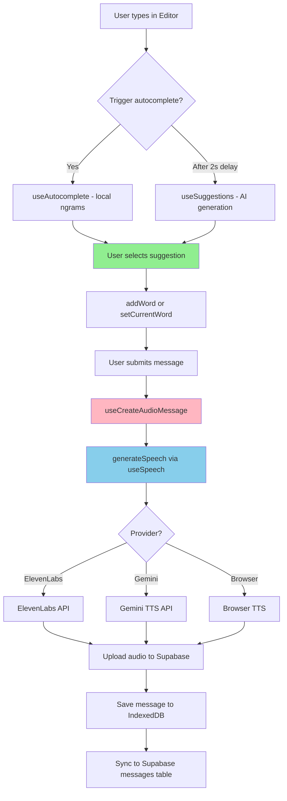
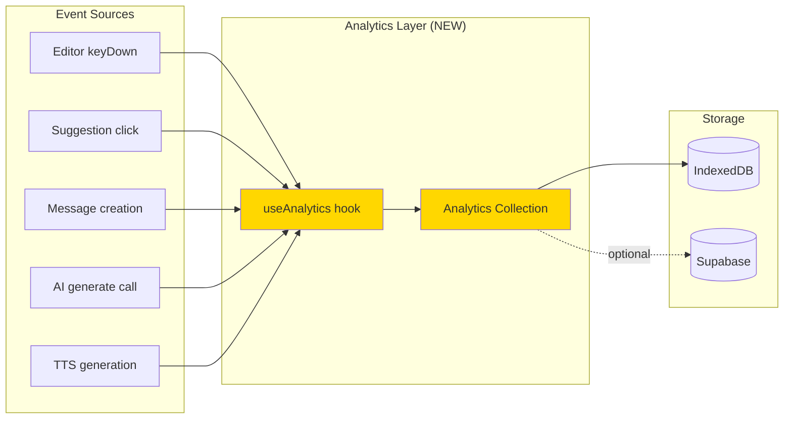
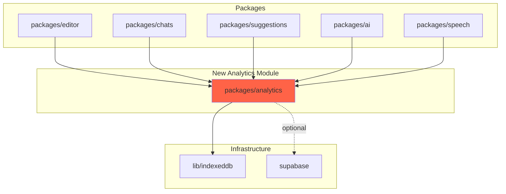

# Dashboard Analytics Research

## Executive Summary

- **Proposed change**: Add analytics/telemetry logging to track user engagement metrics for a usage dashboard
- **Impact scope**: Medium - touches 5+ core packages but most changes are additive (event logging)
- **Key findings**:
  - No existing analytics/telemetry infrastructure - needs to be built from scratch
  - Local-first architecture uses IndexedDB for persistence (via TanStack DB collections)
  - Supabase cloud DB has `messages` and `accounts` tables but no analytics tables
  - Clear event points identified in editor, chats, speech, and AI packages
  - Suggested approach: Create local analytics collection, optionally sync to Supabase

---

## What Exists

### Database Schema

**Supabase (Cloud)**
- [messages table](/Users/raviatluri/work/september/supabase/migrations/20250718095523_create_messages_table.sql) - stores user messages with text, type, audio_path, user_id, created_at
- [accounts table](/Users/raviatluri/work/september/supabase/migrations/20250717102711_create_accounts_table.sql) - stores user profile and AI config (ai_suggestions, ai_transcription, ai_speech, ai_providers JSONB)
- No analytics or metrics tables exist

**IndexedDB (Local)**
- [chats collection](/Users/raviatluri/work/september/packages/chats/db.ts) - stores chat metadata
- [messages collection](/Users/raviatluri/work/september/packages/chats/db.ts) - mirrors Supabase messages locally
- [keyboards collection](/Users/raviatluri/work/september/packages/keyboards/db.ts) - custom keyboard configurations
- [documents collection](/Users/raviatluri/work/september/packages/documents/db.ts) - slide documents
- All use [collection-v2.ts](/Users/raviatluri/work/september/lib/indexeddb/collection-v2.ts) pattern with TanStack DB

### Key Components by Metric

**1. Messages Sent**
- `useCreateMessage()` at [use-create-message.ts:18](/Users/raviatluri/work/september/packages/chats/hooks/use-create-message.ts#L18)
- `useCreateAudioMessage()` at [use-create-message.ts:68](/Users/raviatluri/work/september/packages/chats/hooks/use-create-message.ts#L68)
- Message creation tracked via IndexedDB `messageCollection.insert()`

**2. Keys Typed**
- Editor textarea at [editor.tsx:66](/Users/raviatluri/work/september/packages/editor/components/editor.tsx#L66) - `onChange` handler
- Text state managed by `useEditorLogic()` at [use-editor.ts:7](/Users/raviatluri/work/september/packages/editor/hooks/use-editor.ts#L7)
- No keystroke counting currently implemented

**3. Keystrokes Saved**
- Autocomplete suggestions from `useAutocomplete()` at [use-autocomplete.ts:26](/Users/raviatluri/work/september/hooks/use-autocomplete.ts#L26)
- AI suggestions from `useSuggestions()` at [use-suggestions.ts:55](/Users/raviatluri/work/september/packages/suggestions/hooks/use-suggestions.ts#L55)
- Word addition via `addWord()` at [use-editor.ts:10](/Users/raviatluri/work/september/packages/editor/hooks/use-editor.ts#L10)
- `setCurrentWord()` at [use-editor.ts:19](/Users/raviatluri/work/september/packages/editor/hooks/use-editor.ts#L19)
- No tracking of characters saved vs typed manually

**4. AI Provider Usage**
- `useGenerate()` at [use-generate.ts:100](/Users/raviatluri/work/september/packages/ai/hooks/use-generate.ts#L100) - unified AI generation hook
- Supports Gemini (API) and WebLLM (local browser AI)
- `generateText()` at [use-generate.ts:180](/Users/raviatluri/work/september/packages/ai/hooks/use-generate.ts#L180)
- `generateObject()` at [use-generate.ts:169](/Users/raviatluri/work/september/packages/ai/hooks/use-generate.ts#L169)
- AI registry at [registry.ts](/Users/raviatluri/work/september/packages/ai/lib/registry.ts)
- No usage metrics captured

**5. Speech Provider Usage**
- `useSpeech()` at [use-speech.ts:23](/Users/raviatluri/work/september/packages/speech/hooks/use-speech.ts#L23)
- `generateSpeech()` at [use-speech.ts:64](/Users/raviatluri/work/september/packages/speech/hooks/use-speech.ts#L64)
- ElevenLabs provider at [elevenlabs.ts:38](/Users/raviatluri/work/september/packages/speech/lib/providers/elevenlabs.ts#L38)
- Gemini TTS provider at [gemini.ts](/Users/raviatluri/work/september/packages/speech/lib/providers/gemini.ts)
- Browser TTS provider at [browser.ts](/Users/raviatluri/work/september/packages/speech/lib/providers/browser.ts)
- No usage tracking

---

## How Components Connect

### User Journey Flow



### Data Flow for Analytics



### Module Dependencies



---

## What Will Be Affected

### New Files to Create

**Analytics Package**
- `packages/analytics/hooks/use-analytics.ts` - Hook for tracking events
- `packages/analytics/db.ts` - IndexedDB collection for analytics
- `packages/analytics/types/index.ts` - Event schemas
- `packages/analytics/lib/calculators.ts` - Metric calculations (keystrokes saved, etc.)
- `packages/analytics/hooks/use-dashboard-stats.ts` - Hook to query aggregated stats
- `packages/analytics/index.ts` - Public API
- `packages/analytics/README.md` - Architecture decisions

**Database Migration**
- `supabase/migrations/YYYYMMDD_create_analytics_table.sql` - Optional cloud sync table

**Dashboard Component**
- [app/(app)/dashboard/page.tsx](/Users/raviatluri/work/september/app/(app)/dashboard/page.tsx) - Currently just placeholders, needs to display metrics

### Files to Modify (Add Event Tracking)

**Editor Package**
- [packages/editor/components/editor.tsx:66](/Users/raviatluri/work/september/packages/editor/components/editor.tsx#L66) - Track keystrokes in onChange handler
- [packages/editor/components/autocomplete.tsx:40](/Users/raviatluri/work/september/packages/editor/components/autocomplete.tsx#L40) - Track suggestion acceptance

**Chats Package**
- [packages/chats/hooks/use-create-message.ts:36](/Users/raviatluri/work/september/packages/chats/hooks/use-create-message.ts#L36) - Track message sent event
- [packages/chats/hooks/use-create-message.ts:91](/Users/raviatluri/work/september/packages/chats/hooks/use-create-message.ts#L91) - Track TTS generation for audio messages

**Suggestions Package**
- [packages/suggestions/hooks/use-suggestions.ts:100](/Users/raviatluri/work/september/packages/suggestions/hooks/use-suggestions.ts#L100) - Track AI suggestion generation
- [packages/suggestions/components/suggestions.tsx](/Users/raviatluri/work/september/packages/suggestions/components/suggestions.tsx) - Track suggestion click

**AI Package**
- [packages/ai/hooks/use-generate.ts:162](/Users/raviatluri/work/september/packages/ai/hooks/use-generate.ts#L162) - Track AI provider usage (provider, model, tokens)

**Speech Package**
- [packages/speech/hooks/use-speech.ts:64](/Users/raviatluri/work/september/packages/speech/hooks/use-speech.ts#L64) - Track TTS calls (provider, characters)

---

## Existing Validation

**No existing tests found for analytics** - this is a new feature

**Database patterns to follow:**
- IndexedDB collections use [collection-v2.ts](/Users/raviatluri/work/september/lib/indexeddb/collection-v2.ts) pattern
- Example: [chats/db.ts](/Users/raviatluri/work/september/packages/chats/db.ts)
- BroadcastChannel for multi-tab sync
- Optional Supabase sync via mutation handlers

**Hook patterns to follow:**
- Query hooks return `{ data, isLoading, error }`
- Mutation hooks throw errors, use toast for feedback
- Example: [use-create-message.ts](/Users/raviatluri/work/september/packages/chats/hooks/use-create-message.ts)

---

## Event Logging Points

### 1. Message Sent Event

**Where**: After message creation in `useCreateMessage()`
**Data to log**:
- event_type: 'message_sent'
- user_id: string
- chat_id: string | null
- message_length: number (characters)
- has_audio: boolean
- timestamp: Date

**Calculation**: Count of events where `event_type = 'message_sent'`

---

### 2. Keystroke Event

**Where**: In `<Editor>` onChange handler
**Data to log**:
- event_type: 'keystroke'
- user_id: string
- session_id: string (generated per editor session)
- character_count: number (delta since last event)
- timestamp: Date

**Calculation**: Sum of `character_count` where `event_type = 'keystroke'`

---

### 3. Suggestion Accepted Event

**Where**: In `Autocomplete` and `Suggestions` click handlers
**Data to log**:
- event_type: 'suggestion_accepted'
- user_id: string
- suggestion_type: 'autocomplete' | 'ai_suggestion'
- suggestion_text: string
- characters_saved: number (suggestion length - characters typed)
- timestamp: Date

**Calculation**: Sum of `characters_saved` where `event_type = 'suggestion_accepted'`

---

### 4. AI Provider Usage Event

**Where**: In `useGenerate()` after successful generation
**Data to log**:
- event_type: 'ai_generation'
- user_id: string
- provider: 'gemini' | 'webllm'
- model: string
- feature: 'suggestions' | 'transcription' | 'keyboard_generation'
- prompt_tokens: number (estimate)
- completion_tokens: number (estimate)
- timestamp: Date

**Calculation**: Count by provider, model, feature

---

### 5. Speech Provider Usage Event

**Where**: In `generateSpeech()` after successful TTS
**Data to log**:
- event_type: 'tts_generation'
- user_id: string
- provider: 'elevenlabs' | 'gemini' | 'browser'
- model: string | null
- character_count: number
- has_alignment: boolean
- timestamp: Date

**Calculation**: Count by provider, sum of characters

---

## Proposed Analytics Schema

```typescript
interface AnalyticsEvent {
  id: string;
  user_id: string;
  event_type: 'message_sent' | 'keystroke' | 'suggestion_accepted' | 'ai_generation' | 'tts_generation';
  timestamp: Date;
  
  // Message sent
  chat_id?: string;
  message_length?: number;
  has_audio?: boolean;
  
  // Keystroke
  session_id?: string;
  character_count?: number;
  
  // Suggestion accepted
  suggestion_type?: 'autocomplete' | 'ai_suggestion';
  suggestion_text?: string;
  characters_saved?: number;
  
  // AI generation
  ai_provider?: 'gemini' | 'webllm';
  ai_model?: string;
  ai_feature?: 'suggestions' | 'transcription' | 'keyboard_generation';
  prompt_tokens?: number;
  completion_tokens?: number;
  
  // TTS generation
  tts_provider?: 'elevenlabs' | 'gemini' | 'browser';
  tts_model?: string;
  tts_characters?: number;
  has_alignment?: boolean;
}
```

---

## Dashboard Metrics Calculation

### Messages Sent
```typescript
const messagesSent = events.filter(e => e.event_type === 'message_sent').length;
```

### Keys Typed
```typescript
const keysTyped = events
  .filter(e => e.event_type === 'keystroke')
  .reduce((sum, e) => sum + (e.character_count || 0), 0);
```

### Keystrokes Saved
```typescript
const keystrokesSaved = events
  .filter(e => e.event_type === 'suggestion_accepted')
  .reduce((sum, e) => sum + (e.characters_saved || 0), 0);

// Efficiency percentage
const efficiency = (keystrokesSaved / (keysTyped + keystrokesSaved)) * 100;
```

### AI Provider Usage
```typescript
const aiUsage = events
  .filter(e => e.event_type === 'ai_generation')
  .reduce((acc, e) => {
    const key = `${e.ai_provider}-${e.ai_model}`;
    acc[key] = (acc[key] || 0) + 1;
    return acc;
  }, {} as Record<string, number>);
```

### Speech Provider Usage
```typescript
const ttsUsage = events
  .filter(e => e.event_type === 'tts_generation')
  .reduce((acc, e) => {
    const key = e.tts_provider;
    acc[key] = {
      count: (acc[key]?.count || 0) + 1,
      characters: (acc[key]?.characters || 0) + (e.tts_characters || 0),
    };
    return acc;
  }, {} as Record<string, { count: number; characters: number }>);
```

---

## Storage Considerations

### Local-First Approach (Recommended)

**Pros:**
- Aligns with existing architecture (IndexedDB for chats, messages, keyboards)
- Works offline
- Fast queries for dashboard
- Privacy-focused (data stays local)

**Cons:**
- Limited to single device
- No cross-device analytics
- Storage quota limits

**Implementation:**
```typescript
// packages/analytics/db.ts
export const analyticsCollection = createCollection(
  indexedDBCollectionOptionsV2({
    schema: AnalyticsEventSchema,
    id: 'analytics',
    kvStoreOptions: {
      dbName: 'app-analytics',
    },
    channelName: 'app-analytics',
    getKey: item => item.id,
  })
);
```

### Cloud Sync Approach (Optional Enhancement)

**Pros:**
- Cross-device analytics
- Long-term storage
- Can analyze aggregate usage across users
- Backup

**Cons:**
- Requires Supabase migration
- Privacy concerns (need user consent)
- Network dependency

**Implementation:**
- Create `analytics_events` table in Supabase
- Add RLS policies (users can only see their own events)
- Batch sync from IndexedDB to Supabase (similar to messages sync pattern)

---

## Open Questions

1. **Privacy & Consent**:
   - Should analytics be opt-in or opt-out?
   - What data privacy notices are needed?
   - Should we anonymize or aggregate before storing?

2. **Data Retention**:
   - How long to keep raw events? (30 days, 90 days, forever?)
   - Should we pre-aggregate to save storage? (daily/weekly summaries)
   - IndexedDB storage quota limits?

3. **Performance**:
   - Should events be batched/debounced to avoid IndexedDB overhead?
   - Keystroke logging - every character or throttled?
   - Background sync to Supabase or real-time?

4. **Scope**:
   - Should we track session duration, active time?
   - Error tracking (failed TTS calls, API errors)?
   - Feature usage (which pages visited)?

5. **Character Counting**:
   - For "keystrokes saved" - how to calculate characters NOT typed due to suggestions?
   - Should we count backspace/delete as negative keystrokes?
   - How to handle paste events?

6. **Dashboard UI**:
   - Date range filters (today, week, month, all time)?
   - Charts (line, bar, pie)?
   - Export functionality (CSV, JSON)?

---

## Similar Patterns in Codebase

**IndexedDB Collections**:
- [packages/chats/db.ts](/Users/raviatluri/work/september/packages/chats/db.ts) - Message and chat collections
- [packages/keyboards/db.ts](/Users/raviatluri/work/september/packages/keyboards/db.ts) - Keyboard collection
- [lib/indexeddb/collection-v2.ts](/Users/raviatluri/work/september/lib/indexeddb/collection-v2.ts) - Collection factory

**Mutation Hooks**:
- [use-create-message.ts](/Users/raviatluri/work/september/packages/chats/hooks/use-create-message.ts) - Message creation with error handling
- [use-create-keyboard.ts](/Users/raviatluri/work/september/packages/keyboards/hooks/use-create-keyboard.ts) - Keyboard creation pattern

**Query Hooks**:
- [use-messages.ts](/Users/raviatluri/work/september/packages/chats/hooks/use-messages.ts) - Query messages from collection
- [use-chats.ts](/Users/raviatluri/work/september/packages/chats/hooks/use-chats.ts) - Query chats with filters
