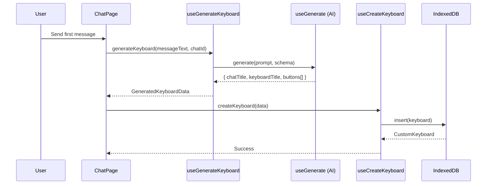
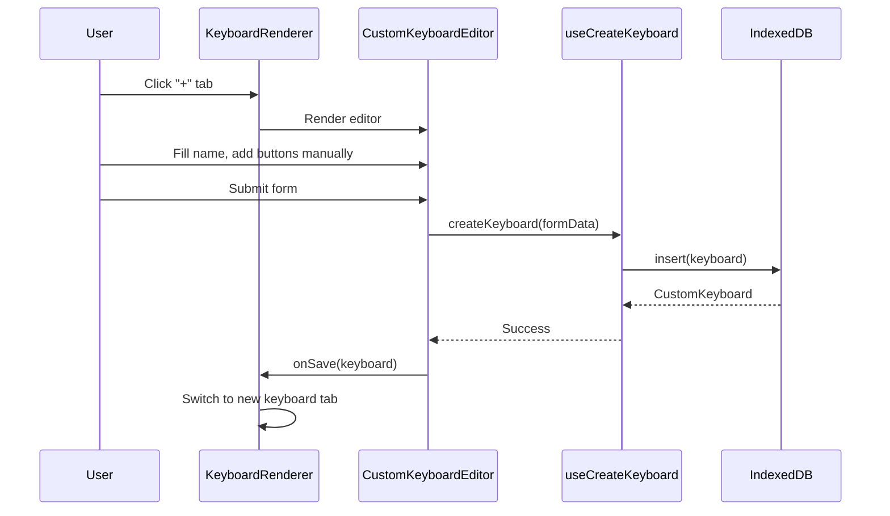
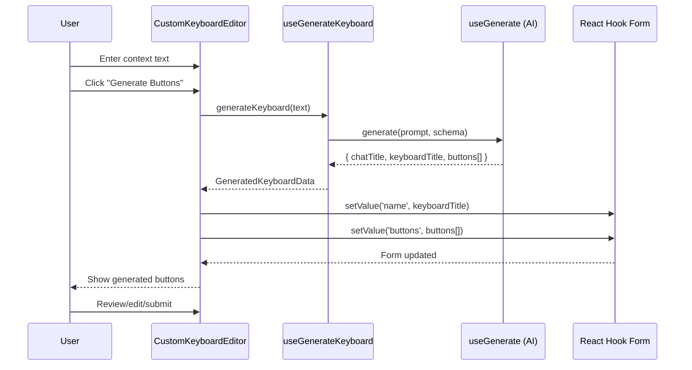
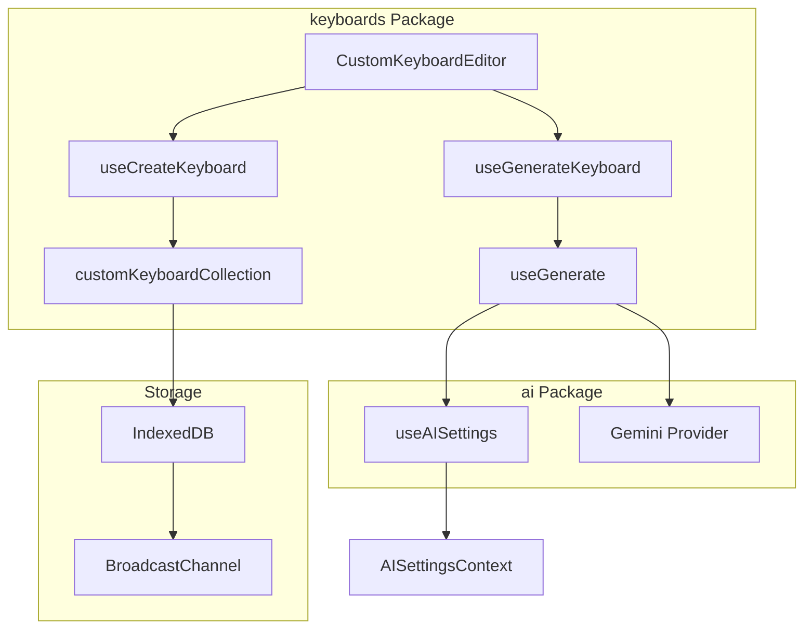
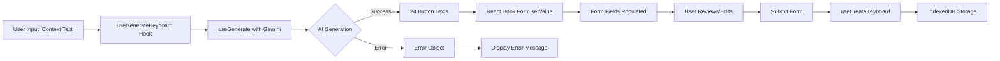

# Research: AI-Generated Keyboard Buttons Integration

**Date**: 2025-12-30  
**Feature**: Integrate `useGenerateKeyboardFromMessage` hook into manual keyboard creation flow

## 1. Executive Summary

- **Proposed Change**: Add AI-powered button generation to the manual keyboard creation UI (`CustomKeyboardEditor`)
- **Impact Scope**: Low - Feature addition to existing component, no breaking changes
- **Key Findings**:
  - AI generation hook already exists and is battle-tested in chat flow
  - Editor component uses React Hook Form with field arrays for dynamic buttons
  - Integration requires adding a "Generate" button that populates the form fields
  - No data model changes needed - hook output maps directly to form structure

## 2. What Exists

### 2.1 AI Generation Hook

**File**: [use-generate-keyboard.ts](../packages/keyboards/hooks/use-generate-keyboard.ts)

**Key Function**: `useGenerateKeyboardFromMessage()` at [use-generate-keyboard.ts:76](../packages/keyboards/hooks/use-generate-keyboard.ts#L76)

**Inputs**:
- `messageText: string` - User's message to analyze for context
- `chatId: string` - Chat identifier (used in automatic generation, optional for manual)

**Outputs**:
- `chatTitle: string` - Descriptive conversation name (max 50 chars)
- `keyboardTitle: string` - Tab label (max 2 words)
- `buttons: string[]` - Exactly 24 phrase starters (max 3 words each)

**Return Type**:
- `generateKeyboard: (params) => Promise<GeneratedKeyboardData>`
- `isGenerating: boolean`
- `error?: { message: string }`

**AI Service**: Uses Google Gemini via `useGenerate` hook from [@/packages/ai](../packages/ai/hooks/use-generate.ts#L100)
- Provider: `suggestionsConfig.provider` (from AI settings context)
- Model: `suggestionsConfig.model` (from AI settings context)
- Requires API key configuration

### 2.2 Keyboard Editor Component

**File**: [custom-keyboard-editor.tsx](../packages/keyboards/components/custom-keyboard-editor.tsx)

**Key Components**:
- Form: React Hook Form with `zodResolver` at [custom-keyboard-editor.tsx:69](../packages/keyboards/components/custom-keyboard-editor.tsx#L69)
- Button Fields: `useFieldArray` for dynamic button management at [custom-keyboard-editor.tsx:104](../packages/keyboards/components/custom-keyboard-editor.tsx#L104)
- Validation: Zod schema at [custom-keyboard-editor.tsx:30](../packages/keyboards/components/custom-keyboard-editor.tsx#L30)

**Form Schema**:
```typescript
{
  name: string,           // Keyboard name
  columns: number,        // Grid columns (2-6)
  buttons: Array<{
    text: string,         // Button display text
    value?: string,       // Optional different output value
    image_url?: string    // Optional button icon
  }>
}
```

**Props**:
- `keyboardId?: string` - For editing existing keyboard
- `chatId?: string` - For chat-specific keyboards
- `onSave?: (keyboard) => void`
- `onCancel?: () => void`

### 2.3 Data Models

**Keyboard Type**: [types/index.ts:26](../packages/keyboards/types/index.ts#L26)
```typescript
interface CustomKeyboard {
  id: string;
  user_id: string;
  name: string;
  buttons: GridButton[];
  chat_id?: string;
  columns: number;
  created_at: Date;
  updated_at: Date;
}
```

**Button Type**: [types/index.ts:17](../packages/keyboards/types/index.ts#L17)
```typescript
interface GridButton {
  id: string;        // nanoid
  text: string;      // Display text
  value?: string;    // Optional output value
  image_url?: string;
  order: number;     // Display order
}
```

### 2.4 Storage Layer

**Database**: TanStack DB with IndexedDB at [db.ts:5](../packages/keyboards/db.ts#L5)
- Collection name: `custom-keyboards`
- Database name: `app-custom-keyboards`
- BroadcastChannel: `app-custom-keyboards` (multi-tab sync)

**Mutations**:
- `useCreateKeyboard`: [use-create-keyboard.ts:15](../packages/keyboards/hooks/use-create-keyboard.ts#L15)
- `useUpdateKeyboard`: [use-update-keyboard.ts:15](../packages/keyboards/hooks/use-update-keyboard.ts#L15)

## 3. How Components Connect

### 3.1 Current Automatic Generation Flow (Chat Page)



### 3.2 Current Manual Creation Flow



### 3.3 Proposed Manual Generation Flow



### 3.4 Module Boundaries



## 4. What Will Be Affected

### 4.1 Files to Modify

**Primary**: [custom-keyboard-editor.tsx](../packages/keyboards/components/custom-keyboard-editor.tsx)
- Add import for `useGenerateKeyboardFromMessage` hook
- Add text input field for generation context (lines 159-187 region)
- Add "Generate" button near "Add Button" (line 194-201 region)
- Add handler function to call generation and populate form fields
- Handle loading/error states during generation

**Estimated Changes**: ~50-80 lines of code

### 4.2 UI Changes Needed

**Location**: Between "Columns" field and "Buttons" grid (lines 188-189)

**New Elements**:
1. Text area for context input (e.g., "Describe the conversation topic")
2. Generate button with loading state
3. Optional: Clear/reset button for generated content
4. Error message display area (if generation fails)

**Existing UI to Preserve**:
- Manual "Add Button" functionality (line 194)
- Grid preview with responsive columns (lines 209-235)
- All existing form fields and validation

### 4.3 Form Integration Points

**Field Array Operations**: [custom-keyboard-editor.tsx:104-107](../packages/keyboards/components/custom-keyboard-editor.tsx#L104-L107)
- `append()` - Add single button (currently used)
- `remove()` - Delete button (line 227)
- **New**: `replace()` - Replace all buttons with generated array

**Form Methods Needed**:
- `form.setValue('name', keyboardTitle)` - Populate keyboard name
- `form.setValue('buttons', generatedButtons)` - Populate all buttons at once
- `form.setError()` - Show generation errors in form

## 5. Existing Validation

### 5.1 Tests

**No test files found** for keyboards package - integration will need manual testing

**Manual Test Plan**:
1. Open keyboard editor via "+" tab in chat
2. Enter context text (e.g., "Planning a birthday party")
3. Click "Generate Buttons"
4. Verify 24 buttons populate with contextual phrases
5. Verify keyboard name is set
6. Edit generated buttons manually
7. Submit and verify keyboard creation
8. Test error cases (no API key, network failure, invalid context)

### 5.2 Validation Schemas

**Form Schema**: [custom-keyboard-editor.tsx:30-43](../packages/keyboards/components/custom-keyboard-editor.tsx#L30-L43)
- Name: 1-50 chars (matches generation max 50 chars for keyboardTitle)
- Buttons: 1-50 buttons, each 1-50 chars text (generation provides 24 with max 3 words)
- **Compatibility**: Generation output fits within existing validation

**Generation Schema**: [use-generate-keyboard.ts:47-55](../packages/keyboards/hooks/use-generate-keyboard.ts#L47-L55)
- keyboardTitle: 1-50 chars, max 2 words
- buttons: Exactly 24 strings, max 50 chars each
- **Compatibility**: Perfect alignment with form schema

### 5.3 Error Handling

**Hook Error Pattern**: [use-generate-keyboard.ts:110-116](../packages/keyboards/hooks/use-generate-keyboard.ts#L110-L116)
- Returns `error: { message: string }` object
- Logs to console
- Throws error for caller to handle

**Editor Error Pattern**: Currently uses toast notifications for mutations
- **Integration**: Display generation errors inline in form + toast

## 6. Open Questions

1. **UX Flow**: Should generation replace existing buttons or append to them?
   - Recommendation: Replace with confirmation if buttons exist, otherwise replace directly

2. **Context Input**: Should we use a simple text input or a multi-line textarea?
   - Consideration: Users might paste long descriptions or type short phrases

3. **Name Prefill**: Should we auto-populate the keyboard name with `keyboardTitle` or keep it empty for user override?
   - Current behavior in chat flow: Auto-populates and creates immediately
   - Manual flow allows editing before save

4. **Columns Reset**: Should generation also set columns to 3 (as done in chat flow) or preserve user's column choice?
   - Chat flow uses 3 columns by default (line 112 in chat page)

5. **Partial Edits**: After generation, should we allow adding more buttons beyond 24 or enforce the limit?
   - Form schema allows up to 50 buttons
   - Generation provides exactly 24

6. **API Key Missing**: How should we handle missing Gemini API key in the editor?
   - Hide generate button entirely?
   - Show disabled button with tooltip?
   - Show enabled button but fail gracefully with helpful error?

7. **chatId Requirement**: Generation hook requires `chatId` parameter - should we:
   - Make it optional in manual creation?
   - Pass `undefined` or empty string?
   - Remove chatId requirement from hook signature?

---

## Data Flow Summary



## Integration Points for AI Generation

**Best Integration Location**: Between lines 188-189 in `CustomKeyboardEditor`

**Why**:
- Natural position after basic metadata (name, columns)
- Before manual button management (maintains fallback)
- Groups generation controls visually
- Allows generated buttons to flow into existing grid preview

**Pattern to Follow**: Similar to chat page integration at [page.tsx:101-132](../app/(app)/chats/[id]/page.tsx#L101-L132)
- Non-blocking generation
- Toast notifications for success/failure
- Silent failure for missing API key (optional for manual flow)
- Async/await with try/catch

---

**Research Complete**. Ready for planning phase.
