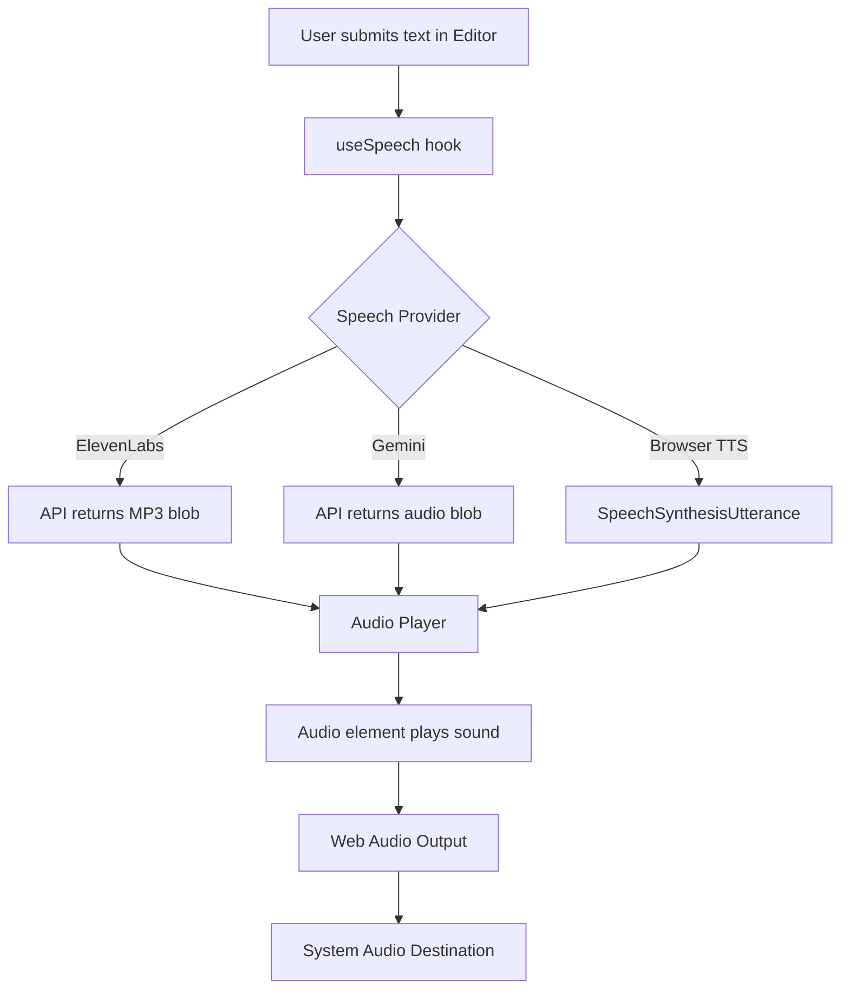
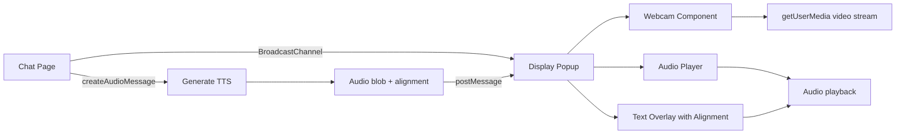
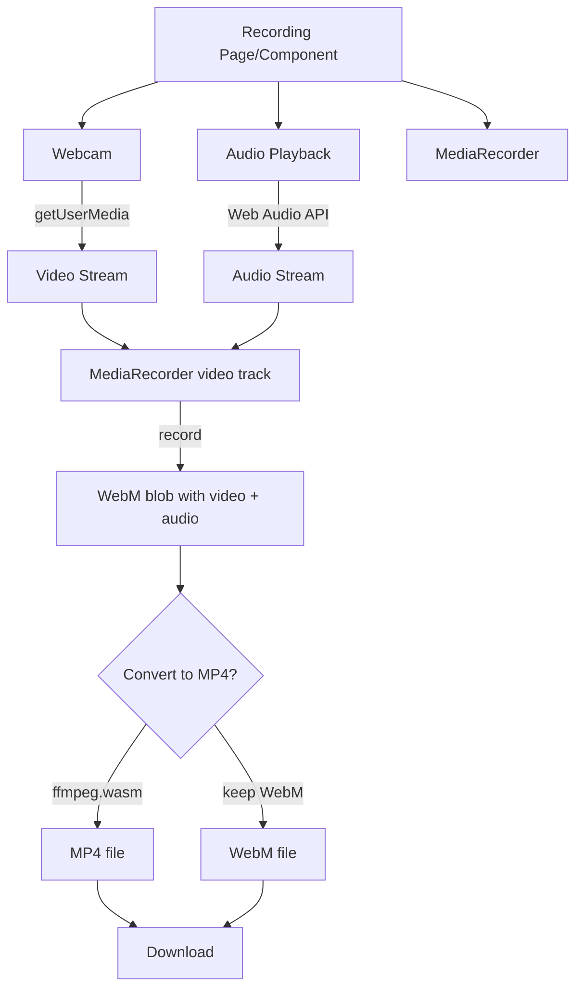

# Webcam Video and Audio Recording Feature Research

**Date**: 2025-12-30  
**Status**: Research Complete  
**Scope**: Implement webcam video recording with synthesized audio output and download as MP4 file with control bar

## Executive Summary

- **Proposed Change**: Add recording capability to capture webcam video + generated TTS audio into downloadable MP4 file
- **Impact Scope**: Low to Medium
  - New package needed: `packages/recording` (following modular pattern)
  - Integration point: Display page or new recording page
  - No changes to existing audio/speech packages
  - May require `ffmpeg.wasm` for WebM to MP4 conversion
- **Key Findings**:
  - Webcam infrastructure exists (react-webcam@7.2.0 already installed)
  - MediaRecorder API usage exists in cloning package (audio-only)
  - Audio is generated as base64 blobs (MP3 from ElevenLabs, Browser TTS uses SpeechSynthesisUtterance)
  - Display page shows webcam + audio playback pattern
  - No video recording or ffmpeg dependencies currently exist
  - Need to capture audio destination from Web Audio API for recording

---

## 1. What Exists

### Webcam Infrastructure

**Package**: `react-webcam` v7.2.0 (already installed)

**Current Usage**: [app/display/[id]/page.tsx:62-71](/Users/raviatluri/work/september/app/display/[id]/page.tsx#L62-L71)

```tsx
<Webcam
  audio={false}
  ref={webcamRef}
  className="absolute inset-0 w-full h-full object-cover"
  style={{ transform: 'scaleX(-1)' }}  // Mirror the video
  onUserMediaError={error => {
    console.warn('[Display] Webcam permission denied:', error);
    // Silent failure - will show black background with text overlay
  }}
/>
```

**Features**:
- Mirror mode (scaleX(-1))
- Permission handling
- Video-only mode (audio=false)
- Full-screen display

---

### MediaRecorder API (Audio Only)

**File**: [packages/cloning/hooks/use-media-recorder.ts](/Users/raviatluri/work/september/packages/cloning/hooks/use-media-recorder.ts)

**Current Implementation**:
- Records microphone audio via `getUserMedia({ audio: true })`
- Uses MediaRecorder API
- Outputs WebM audio blobs
- Pattern: start/stop recording, callback on complete

**Key Functions**:
- `startRecording(id: string)` at [use-media-recorder.ts:31-64](/Users/raviatluri/work/september/packages/cloning/hooks/use-media-recorder.ts#L31-L64)
- `stopRecording(id: string)` at [use-media-recorder.ts:66-71](/Users/raviatluri/work/september/packages/cloning/hooks/use-media-recorder.ts#L66-L71)
- `onRecordingComplete(callback)` at [use-media-recorder.ts:73-75](/Users/raviatluri/work/september/packages/cloning/hooks/use-media-recorder.ts#L73-L75)

**Blob Creation**:
```typescript
const blob = new Blob(chunks, { type: 'audio/webm' });
```

**Gaps**:
- Only records microphone audio, not synthesized audio
- No video recording
- No audio destination capture from Web Audio API

---

### Audio Generation Infrastructure

#### Audio Types

**File**: [packages/audio/types/index.ts](/Users/raviatluri/work/september/packages/audio/types/index.ts)

```typescript
interface Audio {
  id?: string;
  text?: string;
  path?: string;
  blob?: string;              // base64 encoded audio (MP3 or similar)
  alignment?: Alignment;      // Character-level timing for word highlighting
  duration?: number;
  utterance?: SpeechSynthesisUtterance;  // Browser TTS
}
```

#### Speech Providers

**1. ElevenLabs Provider**  
[packages/speech/lib/providers/elevenlabs.ts](/Users/raviatluri/work/september/packages/speech/lib/providers/elevenlabs.ts)

- Generates MP3 audio via API
- Returns base64 encoded blob: `data:audio/mp3;base64,{base64String}`
- Includes character-level alignment data
- `generateSpeech()` at [elevenlabs.ts:48-114](/Users/raviatluri/work/september/packages/speech/lib/providers/elevenlabs.ts#L48-L114)

**2. Browser TTS Provider**  
[packages/speech/lib/providers/browser.ts](/Users/raviatluri/work/september/packages/speech/lib/providers/browser.ts)

- Uses Web Speech API (`SpeechSynthesisUtterance`)
- Returns utterance object, not audio blob
- No downloadable audio data
- `generateSpeech()` at [browser.ts:14-42](/Users/raviatluri/work/september/packages/speech/lib/providers/browser.ts#L14-L42)

**3. Gemini Speech Provider**  
[packages/speech/lib/providers/gemini.ts](/Users/raviatluri/work/september/packages/speech/lib/providers/gemini.ts)

- Similar to ElevenLabs (API-based)
- Returns base64 audio blob

#### Audio Playback

**File**: [packages/audio/components/audio-player.tsx](/Users/raviatluri/work/september/packages/audio/components/audio-player.tsx)

**Features**:
- Queue-based playback system
- Uses `react-use-audio-player` library
- Handles both blob and utterance playback
- Time tracking via requestAnimationFrame
- `enqueue()` function at [audio-player.tsx:151-167](/Users/raviatluri/work/september/packages/audio/components/audio-player.tsx#L151-L167)

**Audio Source Creation**:
```typescript
const src = blob?.startsWith('data:') ? blob : `data:audio/mp3;base64,${blob}`;
load(src, { autoplay: true, onend: () => { ... } });
```

**Key Hook**: `useAudioPlayer()` at [audio-player.tsx:197-201](/Users/raviatluri/work/september/packages/audio/components/audio-player.tsx#L197-L201)

---

### Display Page (Webcam + Audio Pattern)

**File**: [app/display/[id]/page.tsx](/Users/raviatluri/work/september/app/display/[id]/page.tsx)

**Features**:
- Webcam video with text overlay
- Receives messages via BroadcastChannel
- Auto-plays audio on message receipt
- Word-by-word text highlighting (via alignment)
- Dynamic text sizing based on word count

**BroadcastChannel Pattern**:
```typescript
const channelName = `chat-display-${chatId}`;
const channel = new BroadcastChannel(channelName);

channel.onmessage = (event: MessageEvent<DisplayMessage>) => {
  const msg = event.data;
  if (msg.type === 'new-message') {
    setLatestMessage(msg);
    if (msg.audio) {
      enqueue({ blob: msg.audio, alignment: msg.alignment });
    }
  }
};
```

**DisplayMessage Type**: [types/display.ts](/Users/raviatluri/work/september/types/display.ts)
```typescript
type DisplayMessage = {
  type: 'new-message';
  message: Message;
  audio?: string;        // base64 encoded audio blob
  alignment?: Alignment;
  timestamp: number;
};
```

---

### UI Components (shadcn/ui)

**Available Components**:
- [Button](/Users/raviatluri/work/september/components/ui/button.tsx) - Multiple variants and sizes
- [Progress](/Users/raviatluri/work/september/components/ui/progress.tsx) - Progress bars
- [Slider](/Users/raviatluri/work/september/components/ui/slider.tsx) - Range controls
- [Separator](/Users/raviatluri/work/september/components/ui/separator.tsx) - Dividers

**Recording UI Pattern** (from cloning package):  
[packages/cloning/components/record.tsx](/Users/raviatluri/work/september/packages/cloning/components/record.tsx)

- Record button (Mic icon) → Stop button (Square icon)
- Play button → Stop playback
- Delete button (Trash2 icon)
- Status indicators (recording, playing, uploaded)
- Error display

---

## 2. How Components Connect

### Current Audio Generation Flow



### Current Display Page Flow



### Proposed Recording Architecture



### Audio Destination Capture Challenge

**Problem**: Audio generated via TTS is played through `<audio>` element or SpeechSynthesis, but MediaRecorder needs a MediaStream.

**Solution Options**:

**Option A: Web Audio API Destination Capture**
```typescript
// Create audio context
const audioContext = new AudioContext();
const destination = audioContext.createMediaStreamDestination();

// Load audio element
const audioElement = new Audio(base64Blob);
const source = audioContext.createMediaElementSource(audioElement);
source.connect(destination);
source.connect(audioContext.destination); // Also play it

// Use destination.stream for MediaRecorder
```

**Option B: Capture from Tab Audio (Chrome only)**
```typescript
const stream = await navigator.mediaDevices.getUserMedia({
  audio: {
    mandatory: {
      chromeMediaSource: 'tab'
    }
  }
});
```

**Option C: Pre-generated Audio Mixing**
- Generate all audio first
- Mix audio track with video track
- More complex but more reliable

---

## 3. What Will Be Affected

### New Package: `packages/recording`

**Structure** (following keyboards/documents pattern):
```
packages/recording/
├── components/
│   ├── recording-provider.tsx     # Context provider
│   ├── recording-controls.tsx     # Start/stop/download buttons
│   └── recording-preview.tsx      # Webcam preview with overlay
├── hooks/
│   ├── use-recording.ts           # Main recording hook
│   ├── use-video-recorder.ts      # Video + audio MediaRecorder
│   └── use-audio-capture.ts       # Capture audio destination
├── lib/
│   ├── media-converter.ts         # WebM to MP4 (ffmpeg.wasm)
│   └── stream-merger.ts           # Merge video + audio streams
├── types/
│   └── index.ts                   # Recording types, schemas
├── index.ts                       # Public API
└── README.md                      # Architecture docs
```

### Files to Create

#### 1. Recording Hook
**Path**: `packages/recording/hooks/use-recording.ts` (NEW)

**Responsibilities**:
- Start/stop recording
- Combine webcam video + audio destination
- Generate WebM blob
- Optional conversion to MP4
- Download file

**Return Type**:
```typescript
interface UseRecordingReturn {
  startRecording: () => Promise<void>;
  stopRecording: () => void;
  downloadRecording: () => void;
  status: 'idle' | 'recording' | 'processing' | 'ready';
  error: string | null;
  duration: number;
  recordingBlob: Blob | null;
}
```

#### 2. Recording Controls Component
**Path**: `packages/recording/components/recording-controls.tsx` (NEW)

**Features**:
- Record button (red dot when recording)
- Stop button
- Download button
- Duration display
- Status indicator

#### 3. Audio Capture Hook
**Path**: `packages/recording/hooks/use-audio-capture.ts` (NEW)

**Responsibilities**:
- Create AudioContext and destination
- Capture audio from playback
- Return MediaStream for MediaRecorder

#### 4. Media Converter Utility
**Path**: `packages/recording/lib/media-converter.ts` (NEW)

**Responsibilities**:
- Convert WebM to MP4 using ffmpeg.wasm
- Progress callbacks
- Error handling

---

### Integration Points

#### Option 1: New Recording Page
**Path**: `app/(app)/recording/page.tsx` (NEW)

**Features**:
- Dedicated recording interface
- Full-screen webcam preview
- Control bar at bottom
- Independent of chat functionality

#### Option 2: Display Page Extension
**Path**: `app/display/[id]/page.tsx` (MODIFIED)

**Changes**:
- Add recording controls to display page
- Record while displaying chat messages
- Captures both video and spoken messages

**Recommendation**: Start with Option 1 (dedicated page) for simpler scope.

---

### Dependencies to Add

**1. ffmpeg.wasm** (if MP4 conversion needed)
```json
{
  "@ffmpeg/ffmpeg": "^0.12.x",
  "@ffmpeg/util": "^0.12.x"
}
```

**Alternatives**:
- Keep WebM format (widely supported in modern browsers)
- Server-side conversion (if backend exists)

**2. No other major dependencies needed**
- MediaRecorder API is native
- Web Audio API is native
- react-webcam already installed

---

## 4. Existing Validation

### Tests
**None found** for recording or display features.

**Test Coverage Gaps**:
- MediaRecorder usage
- Webcam permission handling
- Audio stream capture
- Blob download

**Test Files to Create**:
- `packages/recording/hooks/use-recording.test.ts`
- `packages/recording/lib/stream-merger.test.ts`

### Linting
**Configuration**: ESLint configured at project root

**Commands**:
```bash
pnpm run lint    # Run ESLint
pnpm run build   # Type checking
```

### Type Safety
**Current Standards**:
- Zod schemas for data types
- Explicit return types on hooks
- TypeScript strict mode

**New Types Needed**:
```typescript
// packages/recording/types/index.ts
export const RecordingSchema = z.object({
  id: z.string(),
  duration: z.number(),
  format: z.enum(['webm', 'mp4']),
  created_at: z.date(),
});

export type Recording = z.infer<typeof RecordingSchema>;

export type RecordingStatus = 'idle' | 'recording' | 'processing' | 'ready' | 'error';
```

---

## 5. Open Questions

### 1. MP4 vs WebM Format

**Question**: Should we convert WebM to MP4 or keep WebM?

**WebM Pros**:
- Native MediaRecorder output
- No conversion needed
- Smaller file size
- Modern browser support

**MP4 Pros**:
- Better compatibility (iOS, older browsers)
- More universal playback support
- Industry standard

**Recommendation Needed**: Clarify target platform requirements.

---

### 2. Audio Source for Recording

**Question**: Should we record:
- A. Synthesized TTS audio only (from current audio player)
- B. Microphone audio only (like cloning feature)
- C. Both mixed together
- D. User selectable

**Current Display Pattern**: Only plays TTS audio, no microphone.

**Recommendation Needed**: Define audio source requirements.

---

### 3. Recording Trigger

**Question**: How should recording start?
- A. Manual button press
- B. Auto-start on page load
- C. Start when first message is sent
- D. Scheduled/timed recording

**Recommendation Needed**: Clarify user workflow.

---

### 4. Recording Duration Limits

**Question**: Should there be max recording duration?

**Considerations**:
- Browser memory limits (WebM blobs in RAM)
- File size considerations
- Processing time for conversion

**Options**:
- No limit (until user stops)
- 5 minute max
- 10 minute max
- Configurable limit

**Recommendation Needed**: Define limits.

---

### 5. Integration with Display Feature

**Question**: Should recording be:
- A. Separate standalone feature
- B. Integrated into display popup
- C. Available in both modes

**Current Display Usage**: Chat page opens display popup via BroadcastChannel.

**Recommendation Needed**: Clarify relationship between display and recording.

---

### 6. Audio Playback During Recording

**Question**: Should audio play through speakers while recording?

**Options**:
- A. Yes, record what's being played (like screen recording)
- B. Silent recording (audio in file only)
- C. User toggle option

**Recommendation Needed**: Define playback behavior.

---

## 6. Implementation Recommendations

### Phase 1: Core Recording Infrastructure

**Tasks**:
1. Create `packages/recording` structure
2. Implement `use-video-recorder` hook
   - MediaRecorder for webcam video
   - Start/stop/download logic
3. Create basic UI controls component
4. Test WebM video recording

**Files**:
- `packages/recording/hooks/use-video-recorder.ts`
- `packages/recording/components/recording-controls.tsx`
- `packages/recording/types/index.ts`
- `packages/recording/README.md`

---

### Phase 2: Audio Capture

**Tasks**:
1. Implement `use-audio-capture` hook
   - Web Audio API destination
   - Audio element source connection
2. Merge audio stream with video stream
3. Test audio + video recording

**Files**:
- `packages/recording/hooks/use-audio-capture.ts`
- `packages/recording/lib/stream-merger.ts`

---

### Phase 3: UI Integration

**Tasks**:
1. Create recording page or extend display page
2. Add control bar with buttons
3. Add duration display and status indicators
4. Implement download functionality

**Files**:
- `app/(app)/recording/page.tsx` OR
- `app/display/[id]/page.tsx` (modified)

---

### Phase 4: Format Conversion (Optional)

**Tasks**:
1. Add ffmpeg.wasm dependency
2. Implement WebM to MP4 converter
3. Add progress UI during conversion
4. Test conversion performance

**Files**:
- `packages/recording/lib/media-converter.ts`

---

### Phase 5: Polish & Testing

**Tasks**:
1. Add error handling
2. Add permission prompts
3. Write tests
4. Update documentation

---

## 7. Technical Specifications

### MediaRecorder Configuration

**Video Recording**:
```typescript
const stream = await navigator.mediaDevices.getUserMedia({
  video: {
    width: { ideal: 1920 },
    height: { ideal: 1080 },
    facingMode: 'user'
  }
});

const recorder = new MediaRecorder(stream, {
  mimeType: 'video/webm;codecs=vp9',
  videoBitsPerSecond: 2500000, // 2.5 Mbps
});
```

**Audio Destination Capture**:
```typescript
const audioContext = new AudioContext();
const destination = audioContext.createMediaStreamDestination();

// Connect audio element
const audioElement = new Audio(base64Blob);
const source = audioContext.createMediaElementSource(audioElement);
source.connect(destination);
source.connect(audioContext.destination); // Also play

// Get audio stream
const audioStream = destination.stream;
```

**Merging Streams**:
```typescript
const videoTrack = videoStream.getVideoTracks()[0];
const audioTrack = audioStream.getAudioTracks()[0];

const combinedStream = new MediaStream([videoTrack, audioTrack]);

const recorder = new MediaRecorder(combinedStream);
```

---

### Download Implementation

```typescript
const downloadRecording = (blob: Blob, filename: string) => {
  const url = URL.createObjectURL(blob);
  const a = document.createElement('a');
  a.href = url;
  a.download = filename;
  a.click();
  URL.revokeObjectURL(url);
};

// Usage
downloadRecording(recordingBlob, `recording-${Date.now()}.webm`);
```

---

### Control Bar Layout

```
┌─────────────────────────────────────────────────┐
│  [●] Record  [■] Stop  [↓] Download  [00:45]    │
└─────────────────────────────────────────────────┘
```

**Components**:
- Record button (red when recording)
- Stop button (disabled when not recording)
- Download button (disabled when no recording)
- Duration timer (MM:SS format)

---

## 8. Browser Compatibility

### MediaRecorder API
- Chrome: ✅ Yes (47+)
- Firefox: ✅ Yes (25+)
- Safari: ✅ Yes (14.1+)
- Edge: ✅ Yes (79+)

**Coverage**: ~95% global browser support

### Web Audio API
- Chrome: ✅ Yes
- Firefox: ✅ Yes
- Safari: ✅ Yes (with vendor prefix)
- Edge: ✅ Yes

**Coverage**: ~97% global browser support

### getUserMedia
- Chrome: ✅ Yes (requires HTTPS)
- Firefox: ✅ Yes (requires HTTPS)
- Safari: ✅ Yes (requires HTTPS)
- Edge: ✅ Yes (requires HTTPS)

**Note**: Requires HTTPS in production, localhost works in dev.

---

## 9. Risk Assessment

### Low Risk
- ✅ Webcam already implemented and tested
- ✅ MediaRecorder API well-supported
- ✅ Audio generation infrastructure exists
- ✅ Download pattern is straightforward

### Medium Risk
- ⚠️ Audio destination capture complexity
- ⚠️ Stream synchronization (video + audio)
- ⚠️ Memory usage for long recordings
- ⚠️ Browser permission prompts

### High Risk (if MP4 conversion)
- 🔴 ffmpeg.wasm bundle size (~30MB)
- 🔴 Conversion performance in browser
- 🔴 Mobile device compatibility

### Mitigation Strategies
1. **Audio Capture**: Start with simple Web Audio API approach, test thoroughly
2. **Memory**: Add max duration limit, show warning
3. **Permissions**: Clear UI prompts and error messages
4. **MP4**: Keep WebM initially, add MP4 as optional enhancement

---

## 10. Success Criteria

### Functional Requirements
- [ ] Start recording webcam video
- [ ] Capture synthesized audio output
- [ ] Combine video + audio in single file
- [ ] Stop recording on user action
- [ ] Download recording as file (WebM or MP4)
- [ ] Display recording duration
- [ ] Show recording status (idle/recording/processing)

### Non-Functional Requirements
- [ ] No audio/video sync issues
- [ ] Clean memory cleanup on stop
- [ ] Clear error messages for permission denials
- [ ] Responsive control bar UI
- [ ] TypeScript compilation passes
- [ ] ESLint passes

### User Experience
- [ ] One-click start recording
- [ ] Visual indicator when recording active
- [ ] Smooth download without page freeze
- [ ] Clear status feedback
- [ ] Works on desktop browsers (Chrome, Firefox, Safari, Edge)

---

## Appendix A: Similar Patterns in Codebase

### 1. Audio Recording (Cloning Package)
**Pattern**: [packages/cloning/hooks/use-media-recorder.ts](/Users/raviatluri/work/september/packages/cloning/hooks/use-media-recorder.ts)

**Lessons**:
- Use refs for MediaRecorder and stream
- State for status and errors
- Callback pattern for completion
- Clean up streams in onstop handler

---

### 2. Webcam Display (Display Page)
**Pattern**: [app/display/[id]/page.tsx](/Users/raviatluri/work/september/app/display/[id]/page.tsx)

**Lessons**:
- Mirror video with scaleX(-1)
- Handle permissions gracefully
- Full-screen absolute positioning
- Overlay UI on top of video

---

### 3. Audio Playback (Audio Package)
**Pattern**: [packages/audio/components/audio-player.tsx](/Users/raviatluri/work/september/packages/audio/components/audio-player.tsx)

**Lessons**:
- Queue-based approach
- Time tracking via RAF
- Context provider pattern
- Cleanup on unmount

---

## Appendix B: Code Snippets

### Web Audio Destination Capture Example

```typescript
export function useAudioCapture() {
  const audioContextRef = useRef<AudioContext | null>(null);
  const destinationRef = useRef<MediaStreamAudioDestinationNode | null>(null);

  const captureAudio = useCallback((audioBlob: string) => {
    if (!audioContextRef.current) {
      audioContextRef.current = new AudioContext();
      destinationRef.current = audioContextRef.current.createMediaStreamDestination();
    }

    const audioElement = new Audio(audioBlob);
    const source = audioContextRef.current.createMediaElementSource(audioElement);
    
    source.connect(destinationRef.current);
    source.connect(audioContextRef.current.destination);

    audioElement.play();

    return destinationRef.current.stream;
  }, []);

  return { captureAudio };
}
```

### Video + Audio Recording Example

```typescript
export function useVideoRecording() {
  const [status, setStatus] = useState<RecordingStatus>('idle');
  const recorderRef = useRef<MediaRecorder | null>(null);

  const startRecording = async (videoStream: MediaStream, audioStream: MediaStream) => {
    const videoTrack = videoStream.getVideoTracks()[0];
    const audioTrack = audioStream.getAudioTracks()[0];
    const combinedStream = new MediaStream([videoTrack, audioTrack]);

    const recorder = new MediaRecorder(combinedStream, {
      mimeType: 'video/webm;codecs=vp9,opus'
    });

    const chunks: BlobPart[] = [];
    recorder.ondataavailable = (e) => chunks.push(e.data);
    recorder.onstop = () => {
      const blob = new Blob(chunks, { type: 'video/webm' });
      // Handle blob
    };

    recorder.start();
    recorderRef.current = recorder;
    setStatus('recording');
  };

  const stopRecording = () => {
    recorderRef.current?.stop();
    setStatus('processing');
  };

  return { startRecording, stopRecording, status };
}
```

---

## Research Complete

This document provides comprehensive analysis of webcam and audio recording implementation requirements. All major components, dependencies, and integration points have been identified.

**Next Steps**:
1. Review this research document
2. Resolve open questions (Section 5)
3. Confirm format requirements (WebM vs MP4)
4. Proceed to planning phase
5. Implement following recommended phased approach

**Research Document Location**: `/Users/raviatluri/work/september/docs/research/2025-12-30-webcam-audio-recording.md`
