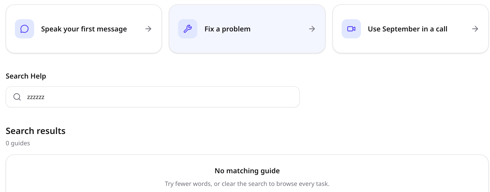
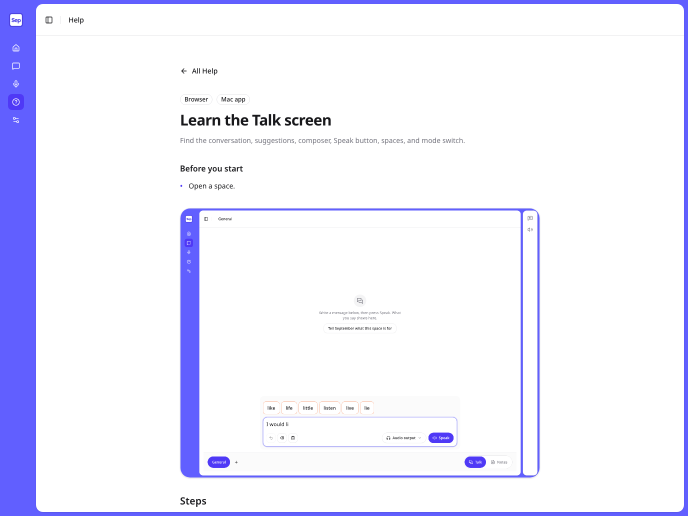
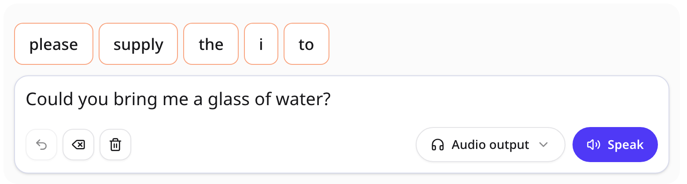
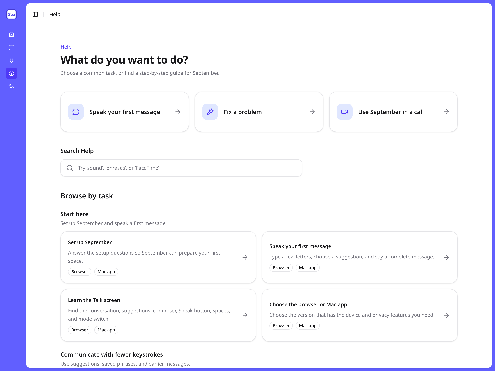
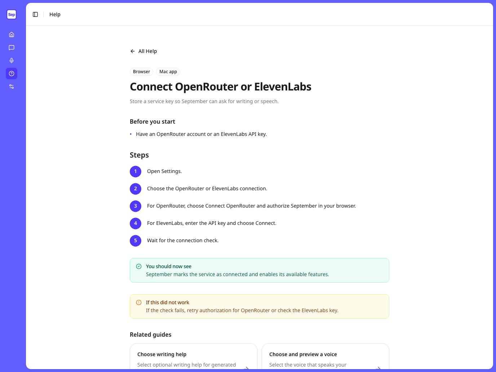

# Help pages at the 13-inch iPad viewport

Implemented after approval. See the [implementation notes](../notes/2026-09-05-help-pages.md). The findings below describe the original review.

Final screenshots: [Help home](2026-09-05-help-pages/after-home.png) and [first-message guide](2026-09-05-help-pages/after-guide.png).

Reviewed the local browser app on 2026-09-05 at **1376 × 1032 CSS pixels**, the landscape default in `DESIGN.md`. Three screenshot agents reviewed Help home, individual guides, and current application controls. These are browser captures at the iPad viewport, not tests on physical iPad hardware or Safari.

The highest-value change is to put a readable screenshot detail beside the step it explains. Keep a full-screen overview for orientation. The catalog has 31 guides, but only the Talk overview currently supplies an image source.

## Fix navigation and outdated guidance first

1. **Make “Fix a problem” work during search.** Enter a search, then press the shortcut. The URL gains a category fragment, but the category does not exist while results are displayed. Clear the query and reveal the troubleshooting section before moving to it. Keep keyboard focus at the destination.
2. **Refresh the Talk overview.** Its image and instructions show Talk and Notes, while the current dock also includes Agent. Capture the current screen before using it in more guides.
3. **Remove a dead-end recovery instruction.** “Create and switch spaces” says to choose “Open the space anyway.” That action is not in the current application. Describe the recovery actions the current screen actually offers.

The search failure, enlarged for inspection:

## Make each screenshot useful at reading size

The Talk overview is rendered at about **718 × 539** inside the guide, from a **1376 × 1032** source. A 14px label in that source appears about 7px tall. The overview also pushes the first numbered instruction below the initial viewport.

Use this pattern:

- Start with the outcome, prerequisites, and first useful instruction.
- Include one current overview to locate the area of the screen.
- Put a close-up directly after the step that uses that control. Keep enough surrounding context to show where the control lives.
- Add a short visible caption that names the action. Keep the written instruction and useful alternative text.
- Provide a clearly labeled **Enlarge screenshot** action. An in-page viewer should have a Close target of at least 44 × 44px, support Escape, and restore focus and reading position. The current image silently opens a bare PNG in another tab.
- Capture at the same 1376 × 1032 CSS viewport with a higher pixel density for crisp detail. Enlarging an old low-resolution crop does not restore detail.

Fresh sample captures demonstrate the framing. The overview uses the default iPad viewport at 2× pixel density. These are candidate guide assets, not a redesigned page. No services were connected and speech was not invoked.

[Open the current Talk overview](2026-09-05-help-pages/talk-full.png).

Place this detail beside the instruction to type a message and press Speak:

Place this detail beside the instruction to change modes:

Start with these illustrations:

| Guide | Overview | Close-up beside the step |
| --- | --- | --- |
| Speak your first message / Learn the Talk screen | Current Talk screen | Suggestions, message input, and Speak; separate mode-dock detail |
| Set up September | Current setup screen | Optional service choices and the action to continue |
| Connect OpenRouter or ElevenLabs | Settings connections | One detail for each provider's distinct connection action |
| Export text, audio, or video | Note with export control visible | Open export choices, including unavailable states |
| Fix missing sound | Talk screen with audio selector located | Open audio selector and the setting to check |

For Mac-only guides, capture the actual Mac UI and label it. A browser viewport cannot verify the virtual microphone or native keyboard.

## Reduce searching and interpretation

The home page already has large task cards and a visible search label. Preserve that spacing. Add category jump links so a reader can reach a task group without scrolling through every guide. The catalog spans 3481px inside a 952px scroll area. Add a large, explicit **Clear search** action to the empty state. Preserve the query and result position when returning from a guide: searching for “sound,” opening a result, and pressing Back currently resets the search. Show **Mac app** on the call shortcut before an iPad reader opens it.

The shared shell also needs an accessibility follow-up: its navigation links measure 32 × 32px and its header toggle 28 × 28px, below the design system's 44 × 44px target requirement. The Help task cards already provide generous targets. Portrait at 1032 × 1376 showed no horizontal overflow.

Use the exact visible control names in instructions. “Answer each setup question” and “Open the note export choices” do not help someone locate the next action. Pair the control name with its screenshot detail.

Separate alternative workflows. The connection guide numbers OpenRouter authorization and ElevenLabs key entry as consecutive steps; label them as separate choices. Likewise, distinguish downloading a backup from restoring one, including the expected result for each.

## Verification for implementation

- Reproduce the search shortcut bug in a failing interaction test before changing it; confirm the destination appears after activation.
- Test screenshot opening, keyboard closing, and focus restoration through the public UI.
- Visually check landscape, portrait, and browser zoom. Do not pin image dimensions, colors, prose, or CSS classes in tests.
- Walk through each illustrated task using fresh sample data and no service keys in screenshots.
- Keep the written guide usable when optional media is unavailable.

The original review made no application changes. The approved findings are now implemented. Existing unrelated working-tree changes were left in place. Source reviewed: `packages/app-ui/pages/help.tsx`, `packages/core/rules/help.ts`, and the current space dock and creation screen. The working tree was changing during review, so connection wording reflects the local captures at that time.
